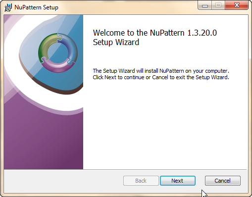
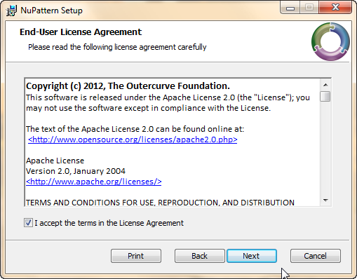
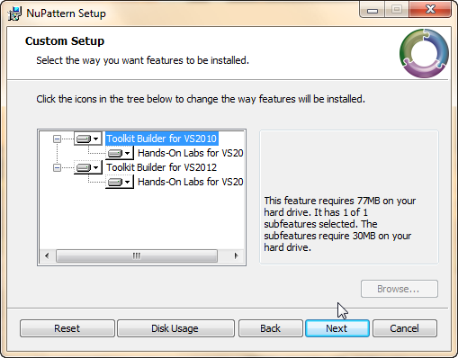
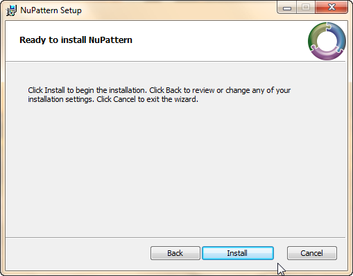
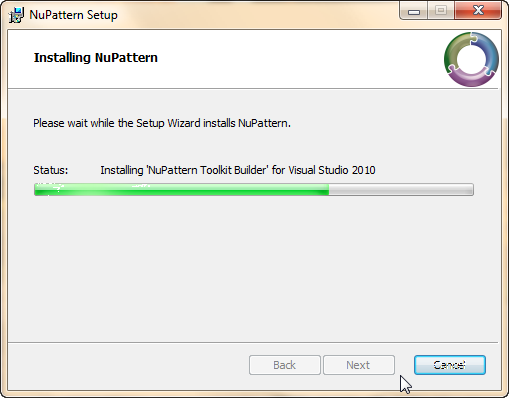
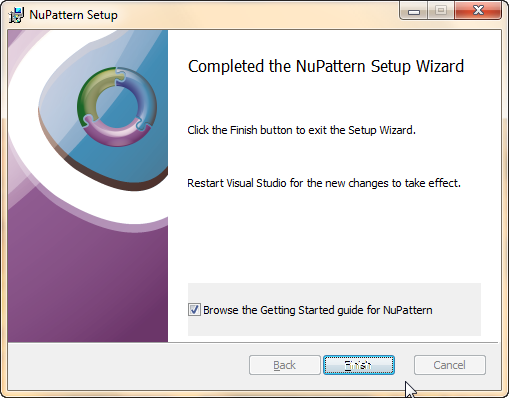
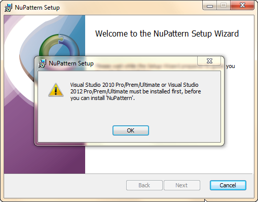
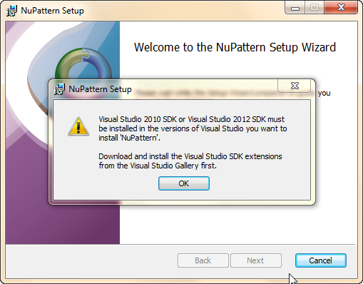
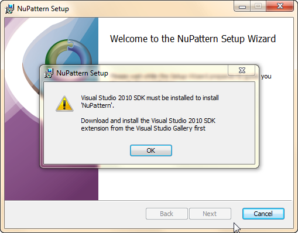
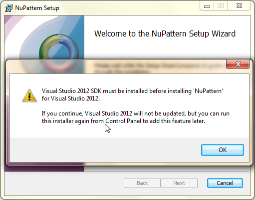

# A New Install Look
This is the sequence of pages in the new combined MSI installer for the NuPattern Toolkit Builder extension and Hands-On Labs extension.
* It verifies that you have Visual Studio Pro or Prem or Ultimate installed for either VS2010 or VS2012 or both.
* It allows you to choose to install the NuPattern Toolkit Builder extension, and the NuPattern Toolkit Builder Hands-On Labs extension for each of the versions of Visual Studio you have installed on the machine: Either VS2010 or VS2012 or both.
* If you have VS installed but not the appropriate VSSDK for one but not the other version of VS, then the installer will warn you that it can't install NuPattern for that version of VS. It will allow you to install to the version of VS + VSSDK that you do have, and will prompt you to re-run the installer once you have installed the other VSSDK later.
* The installer installs the VSIX using the latest version of the VSIXInstaller.exe (i.e. it will use the 10.0 version is you only have VS2010, and it will use the 11.0 version if you have VS2012 or both VS2010 and VS2012.
* At the completion of the install, the user may choose to read the 'Getting Started' wiki guidance online.

## Installation Wizard
The sequence of dialogs looks like this:

See dialogs at bottom, for any failed pre-requisites.

Note: Some of the screen captures above came out with corrupted pixels in the buttons. This is not how the real screens look.

## Failed Pre-Requisites:
If you fail any of the pre-requisities, the following dialogs are shown at the welcome screen:

If you have neither VS2010 or VS2012 installed:

If you have both VS installed, and neither VSSDK installed:

If you have either VS2010 or VS2012, and no SDK installed:

If you have both VS installed, and only one VSSDK installed:
