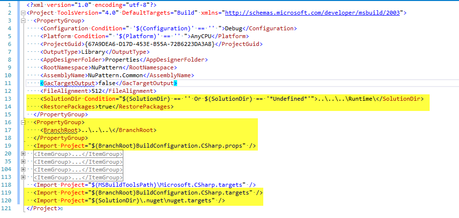
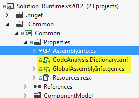
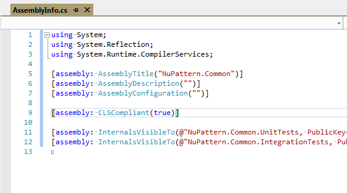
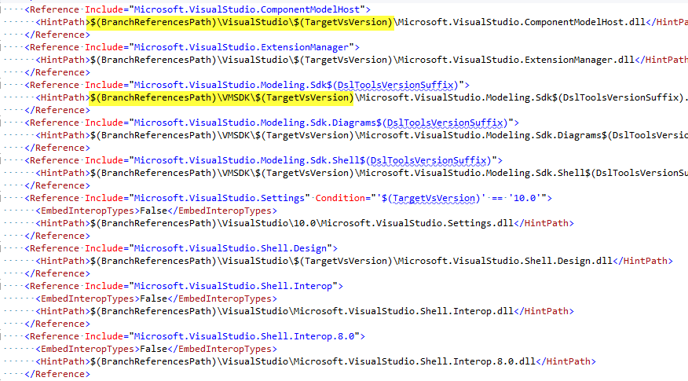
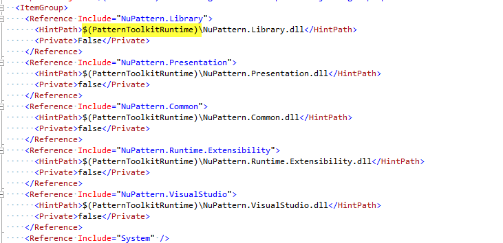

# Source Code Overview

This page has two aims:
# Give you an insight into how the solutions, projects and source code is organized, and why
# Help you decide where to place new code that fits into the existing code base

* [Primary Overview](#overview) – an overview of all the solutions and components
* [Runtime Solution](#runtime) – an overview of the runtime solution.
	* [Library components](#library) – an overview of the library components.
* [Authoring Solution](#authoring) – an overview of the authoring solution.
* [NuPattern Solutions](#solutions) – details about how all solution in NuPattern work.

## {anchor:overview}Primary Overview
Let’s start off by understanding what the major components of the system are, and how they are defined in which solutions.
As we learned already, the project has two major pieces: 
# The _engine_ of NuPattern - the 'Runtime' - is the core piece of NuPattern that manages the operation and integration of toolkits in Visual Studio, provides the extensibility framework, API and integration hooks to Visual Studio. The platform of NuPattern upon which all toolkits are built and run.
# The _developer tools_ that help authors build toolkits - the 'Authoring' - is the piece that helps people build toolkits themselves, in Visual Studio, providing the tools and designers to create and customize a toolkit.
These two major pieces have their own solutions, which compile VSIXes for us, and drop them into a central location for us to deploy (i.e. \src\Binaries folder). 
* The Runtime solution compiles the Runtime VSIX (PatternToolkitManager.vsix) which is packaged into every toolkit that an author builds – this makes it very easy for the user of the toolkit to get started, and not have to install any other Visual Studio extensions.
* The Authoring solution compiles the Authoring VSIX (PatternToolkitBuilder.vsix) which is the one that is installed when toolkit builders install what we term ‘NuPattern’ from the Visual Studio Gallery. It also includes the Runtime VSIX, just like every other toolkit does.
* Additionally, the Authoring solution compiles a third VSIX, the Hands-On Labs VSIX (PatternToolkitBuilderLabs.vsix) which contains the Hands-On Labs toolkit, which is a toolkit that guides people through creating a ‘Pattern Toolkit’ using the ‘Authoring’ VSIX.
At this point in time, we also have a third solution, the ‘Authoring.Setup’ solution that compiles an MSI installer (using WIX) that installs the Authoring VSIX and Hands-On Labs VSIX for both Visual Studio 2010 and Visual Studio 2012, as a convenient means to deploy NuPattern to our authors. But we hoping over time to phase out this MSI installer, and have a single Authoring VSIX that works for all versions of Visual Studio.

### Other Solution Features
In addition to the solutions we have a number of other developer features in the source code tree. 

At the root of the source code 'Src' and under each of the solution folders, we have a 'Clean Code.bat' file - all for your convienience. These are very useful for many situations during development. These batch files remove any non-source controlled files, and all build and test files and folders from your working directories. 
They are very useful for resetting your local working directories and cleaning up the disk for various reasons. They reflect the {"*.gitignore"} file.

* If updating any one of these 'Clean Code.bat' files or the {"*.gitignore"} file, please update all of them wherever they appear in the 'Src' tree.

We maintain seperate solution files for Visual Studio 2010 and Visual Studio 2012, as these files are not compatible. But we share all projects between them. These solution files must remain identical with e fea exceptions, specifically around features that VS2012 does not support that VS2010 did, such as {"*.vsmdi"} files.

* If you make a change to a solution file ({".sln"}), like adding a new project or item to the solution, ensure you sync that change with the other versions of the solution file. Take care, some of the differences are necessary for different versions of Visual Studio, particularly in the first few and last few lines of the files, and files to do with test settings. Contact the project owner or post a query if in any doubt. File diff tools (like DiffMerge) are good tools to sync changes between the files.

**Note:** In all the descriptions about these solutions, we are going to intentionally omit details about the various test projects that each solution has. Each solution contains a number of test projects that are used to create unit, integration and user tests. And may have additional projects that are solely for testing purposes, and used in the tests. These won’t be considered in the details on this page.

### Solution Overview
In the **‘Runtime’** solution, we have the following components:
* Common.* - these are common shared assemblies that are either dedicated to specific namespaces or contain general reusable code. In either case, they contain types that are shared across the whole system, and other toolkits.
* Extensibility.* – this component is the shared piece of the runtime that provides the public runtime services to all toolkits, and the extensibility interfaces that can be extended by all other components, and toolkits.
* Runtime.Internals – these components make up the core engine of the runtime. They are internal implementation only, and not shared by any other components. They provide the: definition of a pattern toolkit, the runtime engine, and the persistence state store. The Runtime.Shell component is the packaging and registration assembly that builds the VSIX that the runtime is deployed in.
* Library.* – this shared library provides a foundational set of shared types (i.e. commands, conditions, value providers, validation rules), and a number of automation extensions (i.e. commands, and various launch points), for configuring toolkits.

The ‘{"Library.**"}’ components in the ‘Runtime’ solution are strictly speaking a separate module to the runtime components. And ideally, we would have a separate ‘Library’ solution containing the ‘{"Library.**"}’ components only. The ‘{"Library.**"}’ components are consumers of the components in the ‘Runtime’ solution, and even extend the runtime components, but are consumed by the components in the ‘Authoring’ solution. The ‘{"Library.**"}’ components are included in the ‘Runtime’ solution for convenience only, and not the ‘Authoring’ solution only because the library assemblies are actually deployed within the Runtime VSIX.

In the **‘Authoring’** solution, we have the following components:
* PatternModelDesign.* - this is the DSL designer provided for editing the ‘Pattern Model’ of a ‘Pattern Toolkit’ project.
* WorkflowDesign.* - this is the DSL designer provided for editing the ‘Production Workflow’ of a ‘Pattern Toolkit’ project.
* Authoring.* - these are components of the ‘Pattern Toolkit’ authoring toolkit. The toolkit that builds ‘Pattern Toolkit’ projects for authors. These components are either toolkits themselves that compose together to build a whole ‘Pattern Toolkit’ project, or automation libraries that provide the automation to build ‘Pattern Toolkit’ projects. The authoring toolkit packages the assemblies and artifacts from all other toolkits and libraries in the solution into a single VSIX.
* HandsOnLabs.* - this pattern toolkit provides a guided Hands-On Labs for building ‘Pattern Toolkit’ projects. And packages the HOL only into a single VSIX.

It is worth understanding that the ‘Authoring’ solution is totally dependent on the ‘Runtime’ solution, as the toolkits contained within the ‘Authoring’ solution depend entirely on the platform defined by the ‘Runtime’ solution. 
It is important to understand who your customers are when you are developing in the codebase:
* When you are developing in the ‘Runtime’ solution, you are primarily addressing the needs of toolkit users, and their experience of using _any_ toolkit.
* When you are developing in the ‘{"Library.*"}’ components, or in the ‘Authoring’ solution you are primarily addressing the needs of toolkit builders, and their experience in building _any_ toolkit.
This is key understanding to have in order to work out where in the system you should be committing your code. Which brings us onto the first determination you need to make in order to figure out where in the code to commit.
**D1.** Who is the intended audience your code is adding value to?
* If a toolkit user, then you should be working in the ‘Runtime’ solution.
* If a toolkit builder or tailor, then you should be working in the ‘Authoring’ solution, or possibly the ‘{"Library.*"}’ components of the ‘Runtime’ solution.

## {anchor:runtime}Overview of the Runtime Solution
Let’s now look a little closer at the ‘Runtime’ solution and how that fits together, and answer the next question: 
**D2.** Where does your code fit into the ‘Runtime’ Solution?

### Common.*
The ‘common’ layer provides a set of assemblies that provide common shared functionality across all assemblies in NuPattern. They have evolved by necessity from developing code that needed to be shared throughout the code base. 

For a very long time this code existed inside various runtime assemblies, and in some cases was duplicated in other assemblies that may have needed to use the same functionality. Over time, illegal references to assemblies were made that violated the architectural layers of the solutions to other assembly’s internals. These assemblies have now been factored out, and are now maintained and split out by namespace as necessary.
This layer is composed of several projects:
* Common (NuPattern.Common.dll)
	* Contains: helpers and extension methods that extend base types in the .NET framework, and as such are organized into the relevant namespaces defined by the .NET framework. 
	* These types have no domain specificity to NuPattern or its concepts, but are used extensively across the codebase.
	* These types are intended to be used by all code in the NuPattern system, and any toolkit that wishes to.
* Common.Presentation  (NuPattern.Presentation.dll)
	* Contains: helpers, extension methods, style definitions, base classes and resources for use in WPF UI elements.
	* These types are specific to NuPattern and how is presents its User Interface elements. As NuPattern is hosted by Visual Studio, the styles and base types in this assembly are derived and extend styles and types defined by Visual Studio, so that NuPattern can visually integrate with Visual Studio UI.
	* These types are intended to be used by all code in the NuPattern system, and by UI elements (e.g. Wizards) in all toolkits.
* Common.VisualStudio (NuPattern.VisualStudio.dll)
	* Contains: helpers, extension methods, interfaces, and service abstractions of the Visual Studio environment. The idea is that this assembly will ultimately provide a managed abstraction layer of Visual Studio that enables all NuPattern components to isolate themselves from differences between Visual Studio versions, or for that matter (in the far future) any specific development tool interface.
	* These types are intended to be used by all code in the NuPattern system, and all toolkits for their UI presentation.
* Common.Modeling (NuPattern.Modeling.dll)
	* Contains helpers, extension methods, interfaces and service abstraction of the Visual Studio VMSDK modeling types (a.k.a DSL Tools).
	* These types are intended to be used by all projects in the NuPattern system that deal with DSL domain models and diagrams. And not intended to be used by toolkits in general.
### Runtime.Extensibility
The ‘extensibility’ layer represents all types, services, interfaces and definitions that are implemented by toolkits and automation library extensions of the runtime. It represents the public interface to the NuPattern engine. 

For a long time, this assembly represented the implementation only of various runtime types and interfaces. Other assemblies (specifically one called Runtime.Interfaces) defined only the interfaces and constants. However, this initial separation of concrete versus abstract types over time became very confusing to consume (had different namespaces), and caused various ugly workarounds and violations in the architecture. Eventually, those assemblies were combined to represent both implementation and definition of the ‘runtime interface’ that shared the same namespace and is intended to be consumed and extended by automation libraries and toolkits alike. The internal only details, were factored into other the runtime engine assemblies.
This layer is composed of several projects:
* Runtime.Extensibility (NuPattern.Runtime.Extensibility.dll)
	* Contains: helpers, extension methods, interfaces, service implementations, reusable types, and base classes for building and executing toolkits on the NuPattern runtime.
	* These types are intended to provide the hooks for extending the runtime experience, and to be used by any extension to the runtime, and all toolkits.
* Runtime.Extensibility.Serialization (NuPattern.Runtime.Extensibility.Serialization.dll)
	* Contains: helper methods and types for serializing OO object to JSon.
	* These types are intended to be used by all projects in the NuPattern system that deal with serialization of data for the runtime and toolkits. And can be used by all toolkits.
### Runtime.Internals
The runtime ‘internals’ layer is intended to represents the guts or engine of NuPattern. It is now a solely internal implementation, and is not intended to be consumed directly by any other assembly. It is a collection of assemblies that together implement all the runtime services and features of the runtime. The types in these assemblies provide an implementation of many of the interfaces defined by the ‘extensibility’ layer.

For a long time, this layer was fully exposed and open to the extensibility, automation library and toolkit layers. As such, it became very polluted with interfaces, implementations and various conveniences, and therefore hard to define and manage. Now this layer is unavailable to other assemblies and toolkits. All integration points are encouraged through the ‘extensibility’ layer.

It is this layer that provides both the standard GUI for managing toolkits (e.g. the dialogs and windows of the Solution Builder), and the services and platform (e.g.  IPatternManager) used to manage toolkits, and persist their state in files of the solution.
This layer is composed of several projects:
* Runtime.Core (NuPattern.Runtime.Core.dll)
	* Contains: the implementation of several critical services for managing toolkits, all UI elements for managing toolkits.
	* Not intended for used by any consuming assemblies.
	* Namespaces:
		* Diagnostics: Manages the creation of the trace output window and relaying trace messages to that window.
		* Settings: Manages reading and writing of the user defined settings for NuPattern in the Options dialogs of VS.
		* UI: Provides all the UI for the Solution Builder window, and other UI elements for toolkits.
		* UriProviders: Provide all the Uri reference service providers.
* Runtime.Schema (NuPattern.Runtime.Schema.dll)
	* Contains: the definition of the pattern model schema, the meta-model that describes the definition of a pattern model of a toolkit.
	* Not intended for used by any consuming assemblies.
	* Namespaces:
		* Design: Contains all System.ComponentModel Descriptors, Converters and Editors used to display all elements as seen in the Pattern Model Designer.
		* Diagram: All customizations to shapes and geometries for the Pattern Model Designer.
		* DomainModel: All customizations to elements for the Pattern Model Designer.
		* GeneratedCode: (Reserved) Contains: all generated code from the ‘DSL Model’ (DslDefinition.dsl).
		* Rehydration: Code that manages the cloning of the Pattern Model definition when a toolkit is customized.
		* Rules: Delete and Property Change rules on elements in the domain model of the DSL.
		* Serialization: Code that extends the serialization and deserialization of the Pattern Model Designer.
* Runtime.Store (NuPattern.Runtime.Store.dll)
	* Contains: the definition of the persistence store used to persist the state of instances of patterns created by pattern toolkits, by the solution builder window, and saved in the solution state file.
	* Not intended for used by any consuming assemblies.
	* Namespaces:
		* Design: Contains all System.ComponentModel Descriptors, Converters and Editors used to display all elements as seen in the Solution Builder window.
		* DomainModel: All customizations to elements for the Pattern Model Designer.
		* GeneratedCode: (Reserved) Contains: all generated code from the ‘DSL Model’ (DslDefinition.dsl).
		* Rules: Delete and Property Change rules on elements in the domain model of the DSL.
* Runtime.Shell (NuPattern.Runtime.Shell.dll)
	* Contains: Visual Studio integration code, registration code and initialization code for installing the runtime and library components into Visual Studio. Contains the VS package class deployed by a VSIX.
	* This assembly has internal access to all runtime ‘internals’ assemblies for the sole purpose of registering and ‘exporting’ their services to Visual Studio and augmenting the Visual Studio environment with menus, commands, tool windows, output panes, etc. that the runtime needs to integrate with the IDE.
	* Not intended for used by any consuming assemblies.
	* Namespaces:
		* Commands: All Visual Studio menu commands.
		* GeneratedCode: Contains the generated guidance documentation, and XSD schemas from the various runtime DSLs.
		* Guidance: The various documents for the guidance as seen in the Guidance Explorer for the Solution Builder window.
		* OptionPages: The pages used to display the user defined options for NuPattern in the Options dialog of Visual Studio.
		* TemplateWizards: Contains Visual Studio Template Wizard extensions that provide automation hooks into VS Project templates that invoke various features of the runtime.
### Other Solution Items
There are many additional items in the Runtime solution that are worth a mention:
* Versioning Project (~~NuPattern.Versioning.dll~~ - not compiled)
	* This project is simply an MSBUILD compatible project that transforms a number of text templates that provide version related data to other projects in the solution.
	* It is not intended to build an assembly, nor be consumed by any other project or assembly. It is simply a convenient container for ensuring that certain critical version files are generated before the rest of the projects in the solution are built.
	* The build order of the solution has been manipulated to ensure that this project is always built first.
	* Also contains various documentation files for developers of the code base containing guidance for managing versioning and signing of the system.
* Various {"**.targets"}/{"**.props"} files
	* Contains shared MSBUILD related properties, targets and tasks that are used to: build the source code, run any code analysis tools, define any shared MS Build properties, transform all text templates, and perform other MSBUILD tasks. (BuildConfiguration.CSharp.*.targets)
	* The {"*.targets"} files are hierarchical, and ensure that all projects in the solution share the same build configurations, assembly information, and version information.
	* Each project in the solution includes at least one of these {"*.targets"} files, depending on what kind of project it is (e.g. a Library project, a DSL project, A VSIX project, A Test Project etc.) 
## {anchor:library}Overview of the Library
Let’s now look a little closer at the ‘Library’ components and how that fits together, and answer the next question: 
**D3.** Where does your code fit into the ‘Library’ part of the ‘Runtime’ Solution?

The ‘automation library’ layer provides toolkit authors with a library of automation types for use in their toolkit. As soon as people starting building toolkits it became apparent that they needed a set of commonly used automation types like: Commands, Conditions ValueProviders, ValidationRules that could be reused by any toolkit. These automation types are very generic, general purpose, and highly configurable, for use in many scenarios. This leaves the domain specific automation type for the toolkit builder to provide, but still lifts a heavy burden off a toolkit builder getting started. 

In additional to the automation types, this ‘library layer’ also defines the automation settings (in a headless ‘DSL Library’), which are seen as the ‘Command’ and various ‘Launch Points’ on a pattern model, that are configurable by toolkit authors. The runtime ‘extensibility’ model permits any ‘automation library’ to define any kind of launch point or other automation constructs for configuring elements in a pattern model. This library layer implements the most commonly demanded ones.
### Library (NuPattern.Library.dll)
Namespaces:
* Automation: Contains the automation settings types (e.g. CommandSettings, and all Launch Point Settings) that are defined in a ‘DSL Library’ that extends the Runtime.Schema DSL. 
* Commands, Conditions, Events, ValidationRules, ValueProviders, ValueComparers: Contains the various reusable general purpose automation types, in their respective namespace.
* Design: Contains all System.ComponentModel Descriptors, Converters and Editors used to display all automation types and settings in the Pattern Model Designer.
* GeneratedCode: (Reserved) Contains: all generated code from the ‘DSL Library’ (DslDefinition.dsl).
* Migration: Contains upgrade processors that are used to transform persisted values in the Pattern Model files, when the persistence of those values changes between versions of the library.
* TemplateWizards: Contains Visual Studio Template Wizard extensions that provide automation hooks into VS Project templates that invoke the automation.

## {anchor:authoring}Overview of the Authoring Solution
Let’s now look a little closer at the ‘Authoring’ solution and how that fits together, and answer the next question: 
**D4.** Where does your code fit into the ‘Authoring’ Solution?

The ‘Authoring’ solution contains the projects that build the toolkit(s) that provide the development tools for toolkit authors, and that create the Hands-On Labs toolkit. This solution actually contains a number of pattern toolkit projects itself! 
Which means that when you develop in the ‘Authoring’ solution you are actually _"a toolkit builder, building toolkits that build a toolkit for toolkit builders to build toolkits!"_ Once you get your head around that the rest is easy. 

The solution contains a couple of DSL designers, which provide the graphical designers that authors use to configure their toolkits. These are standard DSL tools projects, except that because the Pattern Model DSL  is defined in the Runtime.Schema project back in the ‘Runtime’ solution, the ‘Authoring’ solution only contains the half of the DSL project that creates the DSL Designer (Authoring.PatternModelDesigner).

### Toolkits
The main group of projects that compile the Authoring VSIX.
This layer is composed of several projects:
* Authoring.PatternModelDesign.Shell (NuPattern.Authoring.PatternModelDesign.Shell.dll)
	* Registers and integrates the ‘Pattern Model Designer’ into Visual Studio.
	* Not intended for used by any consuming assemblies, except by automation in the PatternToolkit.Automation project that invokes very specific commands on designer.
	* Namespaces:
		* Commands: All commands on the Pattern Model Designer, primarily in the context menus displayed on the designer.
		* DomainModel: All customizations to elements in the domain model.
		* GeneratedCode: (Reserved) Contains: all generated code from the ‘DSL Model’ (DslDefinition.dsl in Runtime.Schema).
		* UI: All UI elements, such as dialogs used in commands on the Pattern Model Designer.
		* Validation: A validation extension for invoking the validation rules on the pattern model.
* Authoring.WorkflowDesign (NuPattern.Authoring.WorkflowDesign.dll)
	* Provides the ‘Production Workflow Designer’ that is used in Pattern Toolkit projects.
	* Generates the Production Workflow Designer code.
	* Not intended for used by any consuming assemblies.
* Authoring.WorkflowDesign.Extensibility (NuPattern.Authoring.WorkflowDesign.Extensibility.dll)
	* Contains interfaces for working with the workflow design.
	* Intended for authoring assemblies wishing to work with the configured design.
	* Namespaces:
		* GeneratedCode: Contains: all generated code for interfaces to the workflow design.
* Authoring.WorkflowDesign.Shell (NuPattern.Authoring.WorkflowDesign.Shell.dll)
	* Registers and integrates the ‘Production Workflow Designer’ into Visual Studio
	* Not intended for used by any consuming assemblies.
	* Namespaces:
		* GeneratedCode: (Reserved) Contains: all generated code from the ‘DSL Model’ (DslDefinition.dsl in WorkflowDesign).
* Authoring.Guidance (NuPattern.Authoring.Guidance.dll)
	* Provides automation that validates and shreds guidance documents (OpenXML standard documents) into data and files that go towards building a guidance workflow for a toolkit.
	* Intended to be used by automation in the PatternToolkit.Automation project.
* Authoring.PatternToolkit (NuPattern.Authoring.PatternToolkit.dll)
	* The toolkit that provides the templates, automation and the pattern model definition for compiling a toolkit that creates and configures ‘Pattern Toolkit’ projects.
* Authoring.PatternToolkitLibrary (NuPattern.Authoring.PatternToolkitLibrary.dll)
	* The toolkit that provides the templates, automation and the pattern model definition for compiling a toolkit that provides the automation classes to pattern toolkit projects.
* Authoring.PatternToolkit.Automation (NuPattern.Authoring.PatternToolkit.Automation.dll)
	* The automation library, containing automation which is shared between the PatternToolkit and PatternToolkitLibrary toolkit projects.
### HandsOn Labs
The group of projects that compile the Hands-On Labs VSIX.
This layer is composed of several projects:
* Authoring.HandsOnLabs (NuPattern.Authoring.HandsOnLabs.dll)
	* The toolkit project that provides the templates, automation and the pattern model definition for compiling a toolkit that guides authors through a process for building their first pattern toolkit project.
* Authoring.HandsOnLabs.Automation (NuPattern.Authoring.HandsOnLabs.Automation.dll)
	* The automation library, containing automation which is used by the HandsOnLabs toolkit project.
### Other Solution Items
Same as with the ‘Runtime’ solution. This area of the solution contains the same artifacts that are used to ensure correct and consistent versioning of the rest of the codebase.

## {anchor:solutions}NuPattern Solutions
Now that we have seen the contents of the individual solutions, there is quite a bit to be said about how the solutions themselves work, and how the projects within them are configured to work.

We have invested a lot of time in NuPattern to automate the compilation of all projects, and ensure the consistency of projects being built in the solutions. You will find that all project files have been modified to be compatible with the solution in some very specific ways. This section is going to describe how those projects are modified, and what the benefits are.

Currently, we support building a version of NuPattern for VS2010 and a version for VS2012. In the future, we hope to only have to build one version of NuPattern for multiple versions of Visual Studio. And great deal of painstaking work has gone into making it dead simple to compile all NuPattern solutions, for any version of Visual Studio. 
In fact, compiling the solutions now only requires Visual Studio to be installed (no other SDK’s or dependencies) as we have all dependencies in our source tree (‘Lib’) folder, and we have ‘Make’ batch files at the root of the ‘Src’ folder that can build the solutions with just MSBUILD on the command line; many times faster than using Visual Studio to do it.

Not only are we compiling the code in the solutions like a regular visual studio project, but we are also doing other automated activities that ensure the code is up to date with respect to the latest configuration in the solution, the targeted Visual Studio version is selected, and that all assemblies are signed and stamped with the same version and configuration information.
### Solution Modifications
Let’s start with looking at how NuPattern solutions are enhanced.

Since NuPattern is targeted at both Visual Studio 2010 and Visual Studio 2012, and Visual Studio solution files are not compatible with each other, we need to maintain 2 versions of the solution files {"**.sln"} in the source tree. These {"**.sln"} files, with the exception of their version number and certain test settings files (no longer supported in VS2012), are identical in every other way, and need to be kept that way.

Furthermore, the build order of the projects in the solution ‘Build Configurations’ have been explicitly modified so that all projects have a build order dependency on the ‘Versioning’ project. This ensures that the ‘Versioning’ project is always the first to be built in the solution regardless. 
The ‘Versioning’ project is a special project that generates ‘include’ files that contain the specific version information about the code and specific version information about the Visual Studio version being used to compile the code. We will see how that works later.
### Project Modifications 
Let’s now see how all projects in a NuPattern solution are modified to ‘enrol’ in this ‘managed’ build process.
#### Targets Import
NuPattern defines a number of shared {"**.targets"} files that are located at the root of the source tree ‘Src’ folder. They are all named like: {"BuildConfiguration.CSharp.**.targets"}. These {"**.targets"} files are hierarchical in that depending on which one you <Import> into your project file it may <Import> others too. 
Every project in a NuPattern solution imports only one of these {"*.targets"} files, depending on what kind of project it is. For example,:
* The ‘Runtime.Schema’ project imports {"BuildConfiguration.CSharp.DslProjects.targets"} because it is a DSL project that needs to reference several other {"*.targets"} files from the VMSDK and VSSDK. 
* The ‘Common’ project imports {"BuildConfiguration.CSharp.targets"} because it is a simple class library project that has the minimum needs of other SDK’s and frameworks. 
There is a {"BuildConfiguration.CSharp.**.targets"} file for every kind of project we have in the NuPattern codebase, and ultimately they all import {"BuildConfiguration.CSharp.targets"} as the base {"**.targets"} file.

In addition, all project also <Import> at least one MSBUILD properties file ({" **.props"}) with a file name like {"BuildConfiguration.CSharp.**.props"}. This file defines a number of key MSBUILD variables at the start of the project file that drive other MSBUILD targets and tasks.

NuPattern uses NuGet to control and install 3rd party packages, like: Moq and Json.NET. ‘NuGet Package Restore’ is configured on all projects in the solution.

Lastly, projects in the NuPattern codebase need to compile and work in both VS2010 and VS2012. We use separate solutions for that. 
All Visual Studio projects are created with a number of standard build configurations (i.e. Debug|AnyCPU, Release|AnyCPU). These are going to be controlled byt the managed build process instead of the project, and so need to be removed. 
VS2012 projects also introduced some new MSBUILD variables, and included a new <Import> at the top of most project files. But this is not needed for VS2010 projects. This needs to be removed to enrol in NuPattern solutions. The NuPattern {"*.props"} file s define a bunch of MSBUILD variables that are common across all code, and some of those need to be removed from the individual project files also.

If we look at a typical C# library project, in a NuPattern solution, we can see where the critical changes have been made to the project file:

We can see the following:
* At the top of the file, VS2012 would have put the following <Import> statement that has now been removed:
{{
<Import Project="$(MSBuildExtensionsPath)\$(MSBuildToolsVersion)\Microsoft.Common.props" Condition="Exists('$(MSBuildExtensionsPath)\$(MSBuildToolsVersion)\Microsoft.Common.props')" />
}}
* In the first <PropertyGroup> the $TargetFrameworkVersion property has been removed.
* In the first <PropertyGroup> we have defined the $SolutionDir variable, and then immediately after, the $RestorePackages variable. These are defined and controlled by NuGet.
* After the first <PropertyGroup> we have defined the $BranchRoot variable (that must navigate up to the ‘Src’ folder), and then immediately after, Imported the {"*.props"} file.
* Immediately after this several build configurations are usually defined, that is: a <PropertyGroup> element with conditions for the build configuration (i.e. Debug|AnyCPU) these have been removed.
* At the end of the project file, immediately after the <Import> for Microsoft.CSharp.targets, we have Imported the appropriate NuPattern {"*.targets"} file.
* Immediately after the NuPattern {"*.targets"} file, we have Imported the nuget.targets file.
This is all it takes to ‘enrol’ the project in the NuPattern solution. From this point forward the project will be enrolled in, and controlled by, the managed NuPattern build process.

#### Shared AssemblyInfo, Code Analysis Dictionary
All projects in a NuPattern solution share the same basic assembly information. This ensures that all assemblies are stamped the right version numbers and have the same product, copyright and manufacturer information. It’s a fairly standard practice in products, and one that is easily achieved by sharing the information in the solution. Projects are still free to define other assembly attributes in their AssemblyInfo.cs file, but many are shared across all projects.
We also need to share some other files that are used by the managed build process.

If you open a project in a NuPattern solution and expand the ‘Properties’ folder you will see that there are two linked files:
* GlobalAssemblyInfo.gen.cs – containing the shared assembly information.
* CodeAnlaysis.Dictionary.xml – containing a dictionary of words that are excluded from the Code Analysis tools for this project. The ‘Build Action’ property on this file is also ‘CodeAnalysisDictionary’

In the AssemblyInfo.cs file, many of the shared attributes have been removed, as these are defined in the GlobalAssemblyInfo file. Attributes that are unique to this assembly as still placed in this file, specifically the ‘AssemblyTitle’, ‘AssemblyDescription’, and others.

#### Assembly References
The final difference in project files in a NuPattern managed solution are the assembly references that the project has. 
The NuPattern source code includes a top level folder called ‘Lib’ that includes all the dependencies of all the projects in the source code (except NuGet packages). Together with NuGet Package Restore, this scheme ensures that code is always being compiled against the precise version of the dependencies, and that the source code base can be built on any machine without needing to install any SDK or 3rd party components (only Visual Studio installed).

In order to ensure that the integrity of the build process works, all assembly references (except those to assemblies in the .Net Framework, and NuGet packages) must reference assemblies in the ‘Lib’ folder.
Since the NuPattern code base has a big dependence on Visual Studio and several Visual Studio SDK’s, the NuPattern {"*.targets"} files include some MSBUILD variables that help reference the correct versions of the assemblies.

If you view the assembly references of a typical NuPattern project, you will see extensive use of these variables:

Furthermore, projects in the ‘Authoring’ solution that reference built assemblies from the ‘Runtime’ solution use another set off MSBUILD variables to define paths to those.

## Versioning Project
The ‘Versioning’ project is a unique project and exists in all solutions of NuPattern (usually in the ‘Solution Items’ folder).
The project is a C# project, but it does not compile an assembly, has no AssemblyVersionInfo and no code. Instead it is simply a convenient MSBUILD compliant project that participates in the managed NuPattern build process.

The first unique thing about it is that no other project has a project reference to it, but it is the first project to build in the solution. This is achieved by intentionally modifying the solution ‘Build Order’ so that all other projects do have a build order dependency on it.
The second unique thing about this project is that it only contains text templates, and other non-compliable files (i.e. documentation files, and the signing key file).

When the project is built, all it does is transform all the text templates. This is important because the output files from these transformations are included in every other project in the solution. (i.e. GlobalAssemblyInfo.gen.cs, and MasterVersion.gen.ttinclude etc.).
To see how and why it transforms the text templates see the next section. The important part about this project is that this transformation is performed before any other project is compiled or transformed.

## Managed Targets
The brains of the NuPattern managed build process is contained in the various {"BuildConfiguration.CSharp.*.targets"} files, that can be seen at the root of the source tree in the ‘Src’ folder.

Given that every project in every solution has an <Import> to a {"BuildConfiguration.CSharp.**.props"} file and an <Import> to a {"BuildConfiguration.CSharp.**.targets"} file, all projects participate in a common set of build activities and share a common set of MBSBUILD configuration.

Let’s take a look at some of these activities. Remember, that the same activities occur for every project in the solution.

Starting with the {"BuildConfiguration.CSharp.*.props"} files. These files define a bunch of MSBUILD variables that are configured based upon the version of Visual Studio that is being used to build the projects. This file also defines all of the possible build configurations (i.e. Debug-VS2012, and Release-VS2012).
By determining the build configuration the MSBUILD variables are correctly assigned. The majority of these variables control where assembly references and other inlcude files like {" *.targets"} files are loaded from, by the projects in the solution.

Furthermore, a variable called “VSVERxx” is initialized and this is included as a ‘build constant’ on all projects, so that code can gain access the version of visual studio as well, and can use {"#if/#else"} type statements to compile code for specific versions of VS.
{{
#if VSVER11
#endif
}}
Now that these MSBUILD variables are correctly initialized, the {"BuildConfiguration.CSharp.*.targets"} files can use these variables to perform build actions.

There are several flavors of {"BuildConfiguration.CSharp.*.targets"} files, each specialized for a specific type of project (i.e. Base, Test, VSIX, DSL, etc.) . But they all include the base {"BuildConfiguration.CSharp.targets"} file. For some of these flavors, they simply add another <Import> or define unique values for various MSBUILD variables that that type of project may need.
We are going to focus on only the base {"BuildConfiguration.CSharp.targets"} files, and what it does to all projects in the solution.

### {"BuildConfiguration.CSharp.targets"}
The first activity that this {"*.targets"} file does is to define the assembly signing information for all assemblies. At present, all assemblies are 'Delay' signed with only a public key provided by the Outercurve Foundation. This necessitates the need to ‘Skip Assembly Verification’ (sn -Vr) on a development machine in order to build the NuPattern assemblies, as the assemblies are not signed when developer builds them. 
The assemblies are signed in an external process at the Outercurve Foundation when a release is made by the Project Owner.
### Code Analysis & XML Docs
The next activity is to apply Code Analysis (CA), StyleCop, and build XML documentation. 
In the current version, CA and StyleCop are turned off. See the ‘Style Guide’ section of the [Coding Guidelines](Coding-Guidelines) page for an explanation why.
### Current Build Verification
The next activity is to verify that the current build configuration matches the actual version of Visual Studio being used to build the solution (i.e. the current build configuration). This verification ensures you have the right ‘Build Configuration’ (i.e. Debug-VS2012) for the current Visual Studio selected. Otherwise you could be building the source code for Visual Studio 2010 in Visual Studio 2012, which would not be right. 
### Transform Templates
The next activity is to transform all text templates in the project. Transforming text templates in NuPattern is automated by the build for several reasons.
Normally, transforming text templates is something that is done manually by a developer as they work with files in the solution. They always do this whenever they make a change to a text template ({"*.tt"}) file, and can manually do this at any time by right clicking on a text template file and selecting ‘Run Custom Tool’. Furthermore, the Visual Studio SDK provides a menu in VS that lets you ‘Transform Templates’ for the whole solution.
However, many of the text templates in the NuPattern solution are dependent on the version of VS that is running, and the current build configuration. It is therefore imperative that all text templates are transformed when the solution is rebuilt.

Also, NuPattern solutions make use of DSL projects, and DSL projects use text templates to generate a lot of their code. One of the problems with the text templates that come in DSL projects is that they include other text templates which are installed by the VMSDK in certain directories on the machine. These included text templates are different depending on the version of Visual Studio SDK you have installed (which will be both if you have VS2010 and VS2012) NuPattern has copied both versions of the included text templates into its ‘Lib’ folder. In order to ensure the right version of these included text templates is used for the right version of Visual Studio, a cloning strategy is employed for the text templates of DSL projects (only). The strategy involves cloning (copying) the right version of the included text templates into a sub folder called ‘DslInclude’ underneath the ‘GeneratedCode’ folder where the DSL text templates are located in the project. We have tried to keep the text templates in the DSL project as close to the defaults as possible to aid when future updates to the VMSDK as deployed. Once copied, the cloned included text templates are used by the DSL project text templates. This works fine, but causes issues if the DSL project text templates are transformed using the Visual Studio ‘Transform Templates’ command for the project or solution. It's a compromise. Therefore, command is not used and not required. No reason to use it. Developers should NOT use that command in NuPattern projects. If they do, the wrong templates may be used, but the build process will overwrite the generated code anyway to be the right code.

Now generally, transforming templates on every build costs in build time, and developers don’t like to be held up, especially during tight TDD cycles waiting just for solutions to rebuild. However, there are mechanisms that cache and detect when it is necessary to re-transform a text template based upon when the template itself was last changed, and this optimizes when text templates are re-transformed or not. This is useful, but also limiting. For these competing reasons, the {"BuildConfiguration.CSharp.targets"} files employs a strategy that forces a re-transformation whenever you ‘Rebuild’ the project or solution in Visual Studio. That means that if you ‘Rebuild’ the project or solution then transformations of all text templates are forced to occur – which is good to ensure that everything is up to date. If you just ‘Build’ the project or solution then the caching mechanism is used to determine whether a transform is necessary or not. You may not get the very latest configuration changes, but the build is far quicker. It is unlikely you are going to spend many TDD cycles in this area of the code, so it goes unnoticed.

This is why we always recommend a ‘Clean and Rebuild’ of the solution to get the latest and most stable build.
### IncludeVSIXAs
The final activity is to copy files that use the <IncludeVSIXAs> property on files in the project.
In VSIX projects, files in the project can be marked with a property called ‘IncludeInVSIX’ it’s a Boolean value. If ‘true’ the file is copied to the output directory and then subsequently packaged as a file in the VSIX container. He file must also have its ‘Build Action’ set to ‘Content’.
Since NuPattern generates lots of text files from text templates, and the naming convention that is used is {"**.gen.**"}, and we don’t want to ship files with these extensions in deliverables (the author/user does not care to see that), there needs to be a way to rename the file to remove the {"**.gen.**"} extension. This is exactly what the ‘IncludeInVsixAs’ target does.
If you specify the <IncludeInVSIXAs> property on any <Item> in a project file, and specify a new file name as the value, this target copies that file to the output directory with the new name, and it will be packaged in the VSIX as a result.
For Example:
{{
<ItemGroup>
	<Content Include="MyFile.gen.cs">
		<DependentUpon>MyFile.tt</DependentUpon>
		<IncludeInVSIXAs>MyCustomerFile.cs</IncludeInVSIXAs>
	</Content>
</ItemGroup>
}} 
Will copy the ‘MyFile.gen.cs’ file to the VSIX, and rename it to ‘MyCustomerFile.cs’