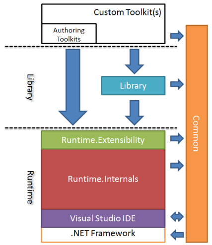

# Coding Guidelines

Welcome to our coding guidelines. In the spirit of keeping things simple and easy, we are providing some quick and easy guidelines about how to understand the code and how code is contributed to the project. There is no intention to create a detailed legal document here or set of immutable rules. But like any other development project we have to have a common understanding of how code should be presented and maintained in the project so that others can quickly grasp its meaning and be able to maintain it. So maintenance (supportability) and ease of understanding are the key drivers here.

We also recognise that one of the hardest parts about contributing to a project like this is knowing exactly where to start and how to fit in; the code that is. So, we encourage investing time into providing detail about how the code is structured, what the pieces are, what they mean and how to determine where to fit your own pieces either extend them or fit in with them. 
You will find more detail in this part than the actual coding guidelines so feel free to jump around.

This page describes a number of things:
* [Our basic Architecture, layers and components of the project](#architecture) – getting your bearings
* [How you can Determine where your code fits](#determination) – learning about how the code is structured, the relationships between the components, and how it all fits together.
* [Patterns we use in development](#patterns) – what patterns we use to make development more exciting and productive.
* [How we Test and Verify the code](#testing) – how we write our tests, where and when
* [How we Version the code](#versioning) - how we version the projects and elements of the code.
* [What’s our Style?](#style) – what practices and coding style we use

## {anchor:architecture}Architecture & Components
Let's not get too stuffy here about architecture, the project certainly has some, but we don't put much emphasis on having an Architect, or having formal description of it. The project's architecture is free to evolve, and it has over the last few years, and it’s fairly settled to fit the current need at this point.

These are basically the layers of the architecture, and how all components interact and are related in the architecture.

## Overview

In essence, the project has two major pieces:
* The engine of NuPattern - the 'Runtime' - is the main, core piece of NuPattern. It manages the operation and integration of toolkits in Visual Studio, provides the extensibility framework, an API and integration framework into Visual Studio. The platform if you like. It is used at 'design-time' when building toolkits and it is used at 'run-time' when operating toolkits.
* The tools that build toolkits - the 'Authoring' - is the design-time (only) piece (like an SDK) that helps people build toolkits themselves in Visual Studio, providing the tools and designers to define and configure a toolkit.

These two major pieces package and deploy themselves separately into a special package called a VSIX (Visual Studio eXtension). Which is essentially a specialized (and rudimentary) installer for Visual Studio extensions. You can browse, download and install VSIXes from anywhere. The '[Visual Studio Gallery](http://visualstudiogallery.msdn.microsoft.com/)', is one such online place that is also integrated into Visual Studio. And our users like to browse and download stuff from within Visual Studio! 
The Visual Studio Gallery is the place we advertise our released code, as well as posting on the CodePlex site.

When someone creates a toolkit of their own (using the 'Authoring' Tools) and compiles their toolkit, the authoring tools create them a VSIX of their own. That VSIX also embeds the runtime VSIX within it. We do this so that when someone installs their toolkit, the runtime can be installed (if not already installed) and the NuPattern runtime is guaranteed to be installed on their machine. This means that users of toolkits don’t need to install anything but Visual Studio to install and use a toolkit. Which is extremely handy for them, and makes NuPattern easy to adopt, and become more pervasive for developers - muhahaha!

You can't have architecture without people, so let’s go there next:

## Our Users
So speaking of audiences, we should probably establish those now:
* The 'User's of toolkits are (generally) developers or infrastructure engineers who develop or deploy software. They need automation and guidance to do their day jobs with their software solutions, and toolkits are targeted directly at them. They may or may not use Visual Studio to do their jobs. But they are used to using good tools that help them configure and control their systems. 
NuPattern is not limited only to software development. In fact many infrastructure engineers have found toolkits extremely useful and productive, versus managing a collection of unrelated PowerShell scripts that they adapt each project.
* The 'Authors' of toolkits are (generally) expert developers or infrastructure engineers who have deeper knowledge and experience about to develop or deploy software reliably. It’s a relative term. They have a desire to provide their peers with guidance and automation that helps them do things more consistently and predictably, to save time and money. They will be using Visual Studio to create toolkits using the 'Authoring' tools.
* The 'Tailors' of toolkits, a new term, are the same as 'Authors', but instead of creating toolkits from scratch, they adapt existing toolkits built by other 'Authors’ or 'Tailors'. Customization of toolkits is a huge piece of NuPattern that is somewhat yet to be realized.

These audiences care deeply about using tools that are easy to understand and use. We don't take that need lightly on this project. Many software engineers prefer computers to people, and have little empathy for their users, or appreciation of the fact that their users don't really care about the software they have to use to do their daily jobs, as much as the engineers who built those tools do. And it is no surprise that the tools those engineers create are not easy to use and are not well received as a result. Developers are users too. This project however is founded on the appreciation that developers want fantastically easy to use and beautiful tools, and the whole goal has always been to produce excellent tools for these audiences that are easy to use, develop with, and customize. 
If it helps you understand what understanding of this idea you need to adopt: “it is dangerous to presume that you are your own user”, which is to say: as you are developing tools for developers, just because you are a developer yourself, don't presume you are building tools for yourself. “You are not your users”. This is a mantra that some of the Visual Studio teams could have used years before they actually started using that mantra, which they do now, and we could have had tools like this years before we actually did.

## {anchor:determination}Where Code Should Go
In terms of how the source code is divided up in the project, and true to '[Conways Law](http://en.wikipedia.org/wiki/Conway%27s_Law)', the project has two solutions. One for the 'Runtime' and one for the 'Authoring'. 

Funnily enough, when we started the project, we had the 'runtime team' and the 'authoring team' as well, and we thought we could keep the teams focused on their user's needs better. But we quickly found out that these two teams didn't really have a good appreciation of the other team’s needs (or their respective audiences), and that caused issues in terms of usability of both pieces. So we quickly squashed that idea. Now, most contributors have had the experience of being both users and authors themselves, and can put themselves in both shoes, and advocate appropriately for both audiences. But boy! did we have some disagreements in the old days about what was important to our audiences, versus what was hard to implement from the teams technical perspective….

Contributing to this project, a project that is mid-stream and whose codebase is at about the 200K mark ([according to OhLo](http://www.ohloh.net/p/nupattern) at least), will be a challenge for a newcomer. We recognize that new contributors will not only have some difficulty finding their way around a matured codebase, but that this project is primarily a Visual Studio integration project, and the kind of patterns, naming and constraints used may be unfamiliar to many as well.
The aim of this section is to provide you with a breakdown of each of the solutions and projects, and provide some guidance on how to understand where to work in the code base.

There is quite a bit of detail here, so we moved this to a separate page on the wiki, see the [Code Overview](Code-Overview) page for more details.

## {anchor:patterns}Design Patterns In Use
These are some of the ‘patterns’ we use on the project, primarily to help us create maintainable and testable code. 
Please keep in mind that development on the project started in 2009, at which point many of these patterns were either already well-established or evolving. So we recognize it may be hard to try to mandate them, but keeping the goals of the these guidelines in mind, consistency and maintainability of the codebase needs to remain a high priority.
* Dependency Injection – Visual Studio 2010 finally supported a DI container by integrating [MEF](http://mef.codeplex.com), which is now an open source project as well. We make extensive use of MEF to solve the age old problem of passing a ‘ServiceProvider’ reference around which gives us access to all the other services in Visual Studio. And, we go much further to provide other global services, and contextual objects to other components in the runtime. Basically, is goes like this:
To use a component in your class you would simply {"[Import](Import)"} the service (notice that we generally define the component by interface):
{{
[Import](Import)
public|internal|protected|private IMyType MyObject { get; set; }
}}
You can also {"[Import](Import)"} into a constructor and other things [using different syntaxes](http://mef.codeplex.com/wikipage?title=Declaring%20Imports).

The DI container would then satisfy that {"[Import](Import)"} automatically from its catalogue of exported types, which are typically defined elsewhere (in the running process, actually the specific catalog).
To provide an exported service or component, you would simply {"[Export](Export)"} the implementation (notice that we generally export the interface):
{{
[Export(typeof(IMyType))](Export(typeof(IMyType)))
internal class MyType : IMyType
{
	// Some implementation of the IMyType interface

// This implementation may have [Import](Import)s also.
}
}}
You can also provide metadata with your export which gives some flexibility in selecting the right kind of {"[Import](Import)"}, generally [when there are possibly multiple exports going on.](http://mef.codeplex.com/wikipage?title=Exports%20and%20Metadata&referringTitle=Guide)
* MVVM – for the UI components, we use WPF and implement our own simple MVVM pattern. We don’t use any frameworks for MVVM, we tend to have few actual forms based UI. When we say MVVM, what we mean concretely is that:
	* We define the actual UI (controls, layout, styles) in a XAML file, with minimal (ideally no) code behind – this is the ‘View’
	* We define a ‘ViewModel’ class that provides the DataContext to the View, and handles all user input, in terms of the ‘Model’.
	* We define a ‘factory’ method that is called by your code to display the form, that binds the ViewModel to the View, and displays the form (in Visual Studio).
* JSON serialization – we serialize a lot of user data to JSON. We discovered early during the project that XML serialized data that we persist for users was quite a pain to merge in their source controlled artifacts. We discovered that a format like JSON with its multi-line presentation of objects, and support for collections, was a better experience for our users. We use the excellent [Json.NET](http://json.codeplex.com) to help us here.
* DSL models – we use a number of DSL projects to define visual definitions and extensibility mechanisms, some of those DSL’s are even ‘headless’ domain models without designers! 
* Text Templates – we make extensive use of generated code in the code base of NuPattern. We dislike repeating code, and duplicating definitions. We may well have about 30% of the NuPattern code being generated by text templates! Since we use several DSL projects to provide both designers and structured storage, we use a lot of text templates pass information defined in those DSL’s into the code. We use text templates a lot so that we can produce code that is targeted to multi-versions of Visual Studio as well. Whenever there is an opportunity to use text templates for whatever purpose, we make that investment.
* Testing patterns – see the [Writing Tests section](#testing)
## {anchor:testing}Writing Tests
NuPattern has always been developed with a test first approach, and as such we have many tests that verify the code. I won’t go into why TDD approaches are so good, if you are not familiar with the rationale behind it please investigate that first. It is so critical to the success and quality of the project, that testing your code is just as important as writing the code to us. 
Test across NuPattern fall into these categories:
* Unit Tests – automated tests that isolate individual classes, and verify they work as designed, or actually designed as the work.
* Integration Tests – automated tests that verify that groups of components work together in the context of a running application (Visual Studio primarily).
* User Tests – automated tests (Coded UI tests) that verify that certain key usage scenarios are working as expected.
* Smoke tests – not automated, but should be, these ensure certain key usage scenarios are working as expected.
Whilst we prefer and will try to insist that all code has unit tests, and covering integration tests, we recognize that given the nature of this project (i.e. a Visual Studio extension) it is not always practical and efficient to provide high levels of coverage with tests in all code. However, it is kind of a premise that code is verified before being committed to the project. Yes, we want you to at least provide unit tests for you code at a minimum.
As mentioned in the ‘Patterns’ section we have a specific testing pattern we had developed some years ago that still lives in the code base. I say this, because I know that the thinking has moved forward, and so have some of the tools to support new thinking. So we are open to evolving if it adds value.
In NuPattern we use the [Moq](http://code.google.com/p/moq) test library to create mocks.
We write all automated tests in this basic format:
{{
[TestClass](TestClass)
public class <Thing>Spec
{
	[TestClass](TestClass)
	public class GivenA<Context>
	{
		[TestInitialize](TestInitialize)
		public void InitializeContext()
		{
		}

		[TestMethod, TestCategory(“Unit)](TestMethod,-TestCategory(“Unit))
		public void When<State>_Then<Result>()
		{
			Assert.True();
		}
	}
}}
Where:
* <Thing> - the name of the class under test.
* <Context> - describes the state of the class. This will usually be set in the InitializeContext() method.
* <State> - describes the state of a specific method or case. This is usually reflected in the setup of the test itself.
* <Result> - describes the expectations of the test.
There are many advantages to this approach, and it is not without some disadvantages too, but it has served us well over the years, and we have consistency in this pattern. Open to new ideas, so please give this a try and then suggest away with relative merits. Please be aware that while you favourite testing pattern today may be more comfortable to you right now, we do have a duty to keep consistency in this codebase for those coming in after us.

Note: As you will see below, we have defined some code snippets (testc, testm) that create this test class structure for you if you have Resharper installed.

## {anchor:versioning}Versioning the Code
The code base contains several things that have versions, that are maintained on different release cycles. Each of these things is related to the main version of the product which changes on a regular basis to reflect the progress in the project. For example: at the time of writing this we are working on version 1.3.20.0 of the NuPattern product, which is expected to change rapidly afterwards.
### The Versioning Philosophy
The philosophy behind the main version number is of course subjective, but it has been the following for the past history of the project. 
* The ‘Major’ number started out at 1 and is not expected to increment until the project has matured several more of the major features of NuPattern. Upon which it will increment to 2, and optimistically, perhaps get to as much as version 5 through the lifespan of the software. 
* The ‘Minor’ number is used to denote key changes or additions in functionality to NuPattern. Ironically, so far in the history of the project it has roughly reflected the 3 product names we have had for the project (PLATU, VSPAT and now NuPattern). 
* The 3rd number the ‘Build’ number has steadily increased with every development iteration, or set of features or fixes. In the first few years of the project when we had a dedicated full-time development team, this number would denote the sprint of the work being performed. This number is now expected to increment with arbitrary sets of features, which denote actual releases of the binaries. Every new release of the code will increment this number. This number has been incrementing sequentially regardless of the ‘Major’ or ‘Minor’ numbers, and as such, is a useful tool to track releases.
* The final ‘Revision’ number has been reserved for emergency fixes that are released. It has always remained at 0. It is not expected to be used, unless we decide to change the versioning philosophy.

### Versioning Sources
The authoritative source of all version numbers in NuPattern (except the DSL schemas, see below) is the ‘MasterVersion.gen.ttinclude’ file, which defines all version information for NuPattern. 

To update the version of the main NuPattern assets (excluding the DSL’s), you simply need to change this file and rebuild the code, which in turn transforms all source code artifacts to use the new version information. 
But this versioning in strategy relies on contributors not specifying version information explicitly in source code artifacts, and instead using the values in these files with text templates to get the version information into the source code. There are many examples of this scattered throughout the code. 

Updating the version of the source code using this method is generally not a regular activity performed by project contributors, but by those creating the binary releases of NuPattern, since those binary release processes include signing and distribution activities as well. However, all project contributors need to be aware of how this mechanism works, so not to compromise the integrity of it.

### Versioning Assemblies & VSIXes 
The main version number of NuPattern is used to version the following:
* All assemblies in both Runtime and Authoring solutions.
* All VSIXes of both Runtime and Authoring solutions.

For assemblies, all projects in all NuPattern solutions share the same ‘GlobalAssemblyInfo.gen.cs’ file that contains the main version number that is used as the version of the assembly number and the file version number. 

For VSIX’es, and various other source artifacts, they include the version information from the ‘MasterVersion.gen.ttinclude’ file directly (or in some cases indirectly) in text templates that create the artifacts.

In VS2010, the version number of a VSIX package was used in the installation path of the VSIX extension. In VS2012 the installation path does not include the version number anymore – which fixes now this issue for extensions such as NuPattern, but introduces random installation paths. 
All toolkit projects (created by authors) reference a number of items from the installation of both the runtime and authoring VSIXes (i.e. assembly references, various {"**.targets"} files, other VSIXes etc.), and as such, these installation paths need to be deterministic, and calculated. NuPattern uses a redirection scheme that has toolkit projects reference a ‘version independent’ {"**.targets"} file that contains the actual installation paths of the current installed version of NuPattern. That {"**.targets"} file is updated whenever the NuPattern extensions are loaded in Visual Studio when it starts. That way, no matter what version of NuPattern is installed, and no matter what version of Visual Studio NuPattern it is installed in, all toolkit projects will be correctly redirected to the installed assets. 

### Versioning Issues
As the NuPattern version number changes all the time, in fact, it will change with every release or update of the code; we have a few other development artifacts that cannot afford to track this version number so rigidly. The primary reason for this is to help manage forward-compatibility, and to reduce manual toolkit migrations by authors.

To understand these issues, and how they are managed, more clearly you have to understand the relationship between the Runtime of NuPattern, and Toolkits which are being built upon it, and some intricacies of some of the Microsoft development technologies NuPattern depends upon.

When a toolkit is created by a toolkit author, the toolkit author creates a number of artifacts in their project that are stamped with version numbers in the author’s source code base, at the time they are created. For example, the ‘Pattern Model’ upon which a toolkit is defined has a schema (or meta-model) associated with it, the version of that schema was defined by the version of the runtime DSL at the time the pattern model was first created. Another example is ‘VS Templates’ that are created in a toolkit when the author creates a project or item template for their toolkit. These template files contain version numbers of components (WizardExtensions) that are also part of the runtime at the time the template is created. Finally, we have VSIX’es that in VS2010 included the version number in the installation directory of the extension, making it very difficult to maintain predictable paths to artifacts that toolkit projects need to reference (i.e. assembly references, and {"*.targets"} files)

Due to certain constraints of the technologies that consume these kinds of example artifacts (i.e. the DSL Tools runtime, and the Visual Studio template system, and the VSIXInstaller), which are out of the control of NuPattern, we need to employ certain versioning strategies that don’t require toolkit authors to manually update these kinds of artifacts when a new version of the NuPattern runtime or NuPattern toolkit builder is deployed. If we don’t employ these versioning strategies, toolkit authors will constantly (and painfully) have to update all their toolkits for all of their users at the same instance when a new version of NuPattern is released, or existing toolkits that are deployed will fail to work due to version incompatibilities.

Let’s give an example to illustrate this: Suppose a toolkit author creates a new toolkit with version 1.0.0.0 of NuPattern. They create a ‘Pattern Toolkit’ project that contains a ‘Pattern Model’ which has version 1.0.0.0 of its schema. They also add a Project Template to their toolkit. They build and deploy their toolkit which packages the 1.0.0.0 version of the NuPattern runtime. Now, two users: Bob and Mary out there in the community download this toolkit and start using it in their solutions. All is going well, they use the project template to create a project in their solution and they use Solution Builder to do some automation on their project. It’s all standard stuff. Now, let’s say that during this time, a new version of NuPattern (v.1.0.1.0) is released on the Visual Studio Gallery. Bob is connected to the internet all the time, and so he gets notified of an update to NuPattern, which he downloads and installs on his machine. Mary is working in a more tightly controlled development environment, and although she may also get the notification of the update to NuPattern, she chooses not download and install it to keep her environment remaining as it was. At this point both Bob and Mary are still able to use their toolkit, with their existing solutions. However, if Bob goes to use the toolkit on another solution, when he goes to unfold that project template, it will fail with an error because the VS Template is looking for an older version of the NuPattern runtime containing a component referenced by the template. In order to fix Bob’s problem, a new version of the toolkit he is using needs to be compiled again (with the 1.0.1.0 version of NuPattern) by the toolkit author, and updated on Bob’s machine. Furthermore, when the author goes to update their version of NuPattern on their machine, where they are building the toolkit, when they go to open their ‘Pattern Model’ file, it will fail to open because it is expecting to load an older version of the pattern model schema, which has also been updated by the updated NuPattern.

It’s a nightmare for everyone, authors and users! We learned at the beginning of the project that when it came to certain artifacts that we choose to use and support in NuPattern (specifically DSL’s, VS Templates, and VSIXes) we had to innovate new versioning strategies to manage version changes for these artifacts. The result is a hybrid versioning strategy that, while not ideal, works well enough without compromising the integrity of versions of these artifacts.

### Versioning DSLs
Versioning DSL’s is a special case for NuPattern. The version information about them is not specified in a central location in the source. It is defined within the DSL file itself.

DSL projects derive their own meta-model (or schema) that itself has a version number. The source of this version number is hardcoded in the XML of a ‘DslDefinition.dsl’ file, and this cannot be influenced outside of this file. Which makes it tough to inject that number from the centralized NuPattern version information, without sophisticated automation. But even if that were possible, there are issues with constantly updating these version numbers. DSL’ schemas were really not expected to be changed as often as the code using them was.
The DSL runtime (in Visual Studio) checks the version of a DSL schema against the version of the instance of the DSL whenever the designer for the DSL loads that instance. The designer will fail to load if the version numbers don’t match, and this is a show stopper for people using the DSL. This is the root cause of the versioning issue for DSL’s, and it not only affects authors of toolkits, but also users of those toolkits, because we share that definition at both design-time for the author and at runtime for the toolkit user.

In order to manage this issue, the version number of the DSL schema should not change frequently. Certainly not at the frequency the main version of NuPattern changes. The philosophy here is that the version number of the DSL schema should only change when the DSL schema creates a breaking change to the schema, otherwise the version of the schema remains constant. To date, the version number of all DSL schemas in NuPattern has reflected the ‘Major’ and ‘Minor’ numbers of the main NuPattern version number. But there is no requirement to rev this number as the main version number changes its ‘Major’ and ‘minor’ numbers.

If the DSL schema version number must change in most of those DSL’s in NuPattern, there are appropriate automated mechanisms (some more mature than others) in the NuPattern runtime that manage the upgrade of the DSL from older schema to newer schemas when instances of the DSL are opened (de-serialized). For some DSL’s in NuPattern, this may require still require a recompile of a toolkit.
Although, there is still potential risk when these DSL schema’s change to toolkit authors and users; to date, the issues have been managed successfully, as the DSL schemas have changed very little as the project has matured.

### Versioning VS Templates
Versioning VS Templates is another special case of versioning for NuPattern because the version information for them is hardcoded in author’s toolkit artifacts.
VS Templates may declare one or more <WizardExtension> elements that define automation that is used to assist in the unfolding the template in the Visual Studio environment. This automation may perform any activity, but it’s usually related to the artifacts unfolded by the template.
The automation is referenced in the <WizardExtension> element by defining its class name and containing assembly, in the standard way most .NET types are represented. (i.e. the fully qualified type name and the fully qualified assembly name). This type and assembly information are then used to instantiate the WizardExtension class instance by Visual Studio when the template is unfolded.
The problem is that Visual Studio needs to find the assembly from one of the standard place sit looks (i.e. the GAC, the VS install directories, extension directories, and several other well-known locations). The fully qualified name of an assembly traditionally contains the assembly strong name, version number, culture and public key token. Without this full information the name is termed a partial assembly name. In VS2010, you could get away with partial assembly names, which permitted you to omit the version number information. In VS2012, however, partial names are no longer tolerated, and fully qualified names, including version number must be provided.

Many of the <WizardExtension> elements that are used by NuPattern toolkits are types that are defined in the versioned assemblies of the NuPattern runtime. That assembly version number is changing with every release. But the VS Template that references that version number is only reflected when the VS Template is first created, or manually updated by the toolkit builder.

The philosophy here is similar to the versioning philosophy of DSL’s. That is, only changing the version number of <WizardExtension> classes when breaking changes are made to them. 
Until recently, the version number of <WizardExtension> classes were omitted to avoid the issue. But with the new release of VS2012, a new strategy must be put in place, as VS2012 for some reason does not load partially qualified types?!?. 
Again, using the philosophy above, all <WizardExtension> implementation defined in the NuPattern runtime components, will maintain the same version number until breaking changes are introduced, at which point new migration strategy (preferably automated) must be sought. 
At the present time, the version number of all <WizardExtensions> has been fixed to 1.0.0.0 to reflect the ‘Major’ number of the main version number. ‘Minor’ versions of the main version number are expected to change more frequently than the <WizardExtension> elements are expected to contain breaking changes. And we view these actual types as really just proxies of the real implementaiton, so they are unlikely to ever change version number, whereas the base implementation types certainly may change version independently.
The source of this version number is the ‘MasterVersion.t4include’ file, which defines this version number and other key version information.

## {anchor:style}Style Guide & Code Quality
And now on to the stuff that all developers love to debate, and try to influence to bend to their comfort level. We have had our share of those debates over the years with various developers on the team, and things have had to change as a result. We have all broken them in the past for whatever reason, and most know the consequences of doing that. Sometimes its justified at the time, but ultimately it always costs somewhere else. 
What I hope we have settled on is a set of minimal guidelines that meet the stated goals of these guidelines that is both progressive and not too restrictive.

### General Coding Practices
These are just the general good development practices, that most of you should feel make sense and help keep the code high quality and maintainable.
* Make it testable first. Use interfaces, preferably internal ones. 
* Reuse, reuse, reuse – You are building a reuse framework and tools, so practice what we preach! We have plenty of shared types and extensions methods in the Common.* libraries, use them and extend them where necessary. Don’t put all of your stuff in there, only the stuff that can be, and _is_ reused.
* Comments – love comments that help understand your code. The purpose of the comment should be to give context about, and reason for, what the code is doing. If all the comment does is repeat the code below it, it probably a waste. Tell us _why_ you are doing it, and what is not evident from the code itself (i.e. the reasons for the code, those hidden assumptions).
* Keep it internal – Unless you plan to make an interface or class 'public' please keep it 'internal'. Open it later if needed. We are an extensibility framework, so please be intentional about what we expose to extend. There have been many differing opinions on this topic. This is an open source project, not a proprietary one, so reopening interfaces is easy - unlike proprietary ones. We have seen other extensibility frameworks take a more ‘open’ approach, and after a while with so much open it made their API far too hard to work with and discover an easy path, and they ended up having to put an alternative simplification layer over the top of that API. We can avoid that waste.
* Localize Resources – Don’t define fixed strings in code that need to be read by a person, put them in resource files. There are certainly many string types that are used for formatting that don’t need to be localized.
	* We name the resource string according to the class name and then purpose. i.e. MyClass_TraceSomething, or MyClass_<Whatever>
	* Exception messages generally follow this format: MyClass_Error<SomeCondition>
	* Exception messages generally follow this format: MyClass_Error<SomeCondition>
* Trace, Trace, Trace – we have extensive support for diagnosing our code, and lots of support for tracing the execution of it. Help us understand what you code is doing at runtime, by tracing what is is going to do, what it is doing and what it has done, and what if anything went wrong - use the trace levels sensibly!
* Generate Duplicity – whenever possible, use text templates to generate code that may either be different given some contextual inputs, code that is derived from other artifacts in the codebase, or code that needs repeating across the codebase but can’t be defined in a shared library.
* Obviate Generated Code – it is helpful for us (and tools) when we can tell at a glance at filenames whether code was hand written or generated. We have a naming standard that says all generated filenames must end in the extension: {"**.gen.**"} (only one exception is {"**.vsixmanifest"} files). Particularly, useful as you will see when committing code for different versions of VS. However, for generated files that ship to our customers we have techniques for removing that extension format. Customers just don’t need to care.
* NuGet - we use NuGet to add 3rd party dependencies, and we use 'NuGet Package Restore', so that these dependencies are downloaded locally at build time, and not stored in the source tree.
* Assembly References - we store all 3rd party non-NuGet packages, target files, and included files in the 'Lib' folder of the source tree, organized by the component name. All assembly references in all projects must be to files in this folder, except .NET framework assemblies. Do not use the 'Add Reference' dialog in Visual Studio to add references to assemblies in the 'Lib' folder, and store all dependencies in the 'Lib' folder (except NuGet ones).
* VS References No More - don't use any types directly from Visual Studio assemblies. Instead create an abstraction of your needed type (with interface, and class factory if necessary) in the Common.VisualStudio project - ideally your abstration would be in terms of general development environment services, not necessarily specific to what VS calls your needed thing. We are in the process of abstracting all VS dependencies behind the Common.VS assembly so that we can support multiple versions of VS down the track.
* Projects Files - take extreme care if needing to change a project file manually, there are several key changes to project files made in NuPattern to enrol in the managed build process. If you ever need to add a new project it must be configured in this way. See [Code Overview](Code-Overview) for more details.
* Commit only VS2012 updates - as a matter of convention, all source code patches and updates are only accepted in the VS2012 build configurations (i.e. compiled in VS2012 with the 'Debug-VS201X' build configuration). You should regression test against the compiled code from the VS2010 solutions with VS2010 build configurations.  Be aware that when the source code is compiled in either build configurations, the projects generate vast numbers (hundreds) of generated source files (of various types). Only generated files in the VS2012 build configurations are accepted. Therefore a typical patch would only include a small number of these generated files. If you have hundreds of them, it is likely that you are submitting a VS2010 build configuration - be careful!
* Document change for Authors - we maintain and ship a vast volume of guidance to help toolkit authors build their toolkits. This structured guidance documents many of the type in the 'Library' and 'Extensibility' assemblies so that toolkit authors become aware of them; what they are, what they do and in some case examples of using them. If you create a cool new feature make sure you let authors know about it in the guidance with a new topic. If you add any automation classes to the 'Library' assembly they need to be updated in the guidance as well. It is imperative that we keep the guidance up to date, and dont let it go stale.

### General Coding Style
The general the ask here is to be consistent with what you see in the existing code, and fix anything that does not fit.

* lambdas and vars – the previous and existing coders on the NuPattern codebase love to be Lazy<T>, love IEnumerables and dislike foreach loops for some reason! Some more than others, but as a result, we make extensive use of lambdas expressions, Linq, Func<T>, Expression<T> and the like. 
	* This style is to be encouraged only to the point of enhancing readability. Long complex and un-wielding lambdas and over complex Whatever<T> make you look super smart, but are not welcome by others trying to understand your wonderful creations. Break them up and break them down please!
* SPACEs versus TABs – a favourite topic. First of all, we don't do mixed, please fix that. The default in Visual Studio is to indent with SPACEs, and we don’t want anyone to have to change any defaults for formatting in our codebase. So SPACE’s it is. (Insert Spaces, NOT Keep Tabs). Two important exceptions are: 
	* 1. The templates that are used to generated text 'one-time' for our customers should have leading TABS in them. The generative process with convert them to whatever the customer preferences are. 
	* 2. Templates that generate repeatedly for customers (over and over again) should use the Indent() and UnIndent() methods, and no SPACES or TABS.
### Coding Style Tools
When the project started we were pretty adamant that we would keep to an extremely high bar for coding style, and so we enforced both FxCop +and+ StyleCop rules (full sets). The development team at the time were not used to developing rapidly under such constraints and this generated far too much friction and reduced their productivity too much to be workable anymore –shame, but there it is. So we relaxed the StyleCop stuff, but persisted with FxCop for a long while. But then the development team started scheduling FxCop clean-up sessions towards ends of sprints, and sometimes that got overlooked and fell to some poor junior developer to complete often after the sprint ended. This practice sometimes introduced several critical bugs into the code (after the sprint, before the demo!), because the person fixing the FxCop violations didn’t write much of the code that violated many of FxCop issues, and inadvertently introduced new bugs with code to quickly fix the violations. We ended up dropping FxCop as part of the code quality gate, as a result – again regretful. The good news, for many developers at least now, is that we no longer enforce static Code Analysis (FxCop) on the project. But the benefits that it brings are still hugely valuable and desirable.

However, recently we have been using [Resharper](http://visualstudiogallery.msdn.microsoft.com/EA4AC039-1B5C-4D11-804E-9BEDE2E63ECF) with its real time Code Analysis. And this tends to be more effective and less of a P.I.T.A. Although, some of the usual suspects are still offended by it, and take the same position against it as FxCop and StyleCop.
In the code base now we have a team settings file for Resharper that is being evolved to suiting the project coding style. It tends to be a great deal smarter that FxCop, and what’s more actually can fix the violations right there and then, and preview the suggestions real-time. Something FxCop could never do for us.
We have also defined a number of code snippets that match the style of the project, such as:
* testc, testm – that create test classes and methods that match our testing pattern.

BTW: If getting a full license for Resharper is an issue for you, become one of our regular contributors and you will be rewarded with a full license from Resharper!
