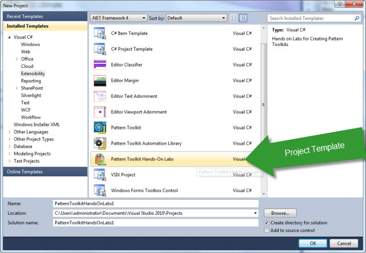
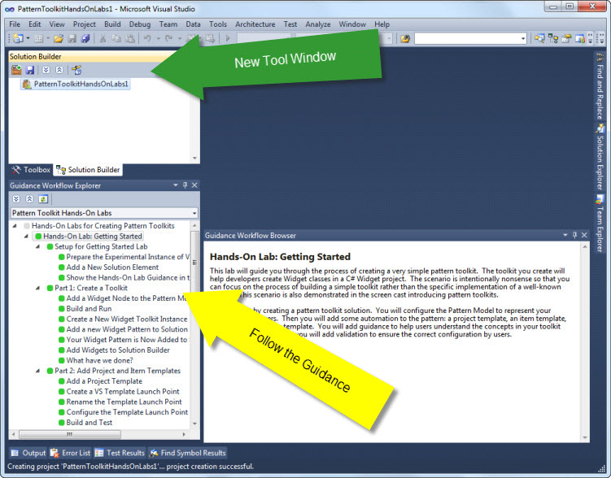
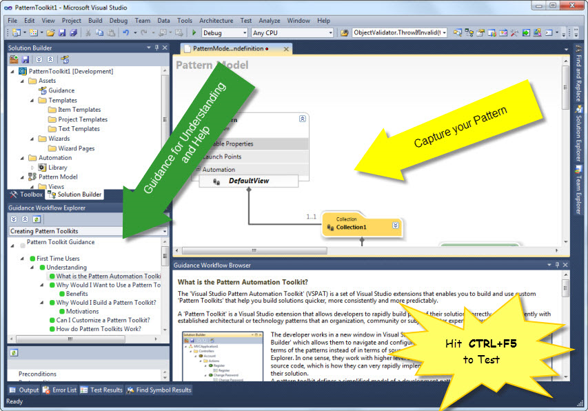
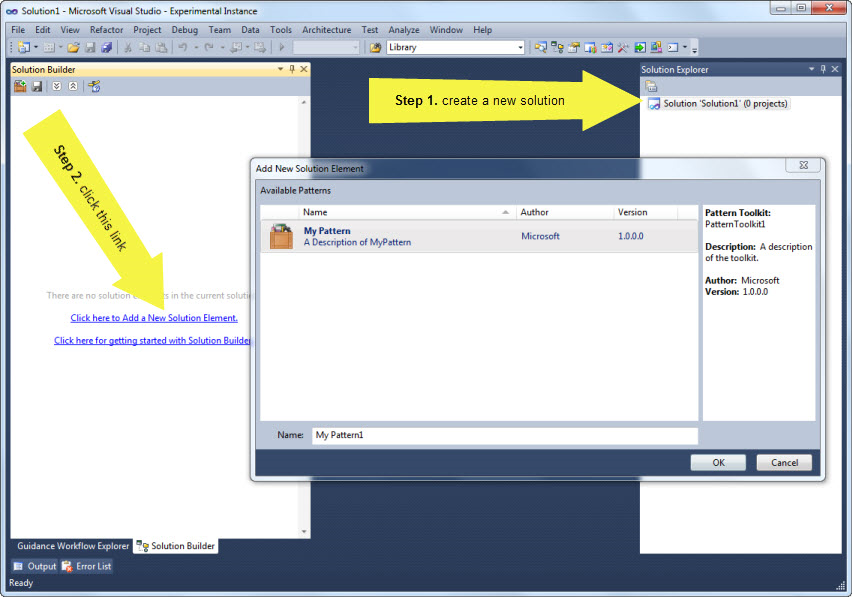

# Getting Started
This is where you learn how to get started building your own pattern toolkits.

If you have never built a pattern toolkit before with NuPattern then we strongly recommend that you get familiar with what NuPattern is all about by installing and using the guided ‘Hands-On Lab’ (HOL) included with the [latest release](http://vspat.codeplex.com/releases). Continue below...

_Note: If you have arrived here after installing NuPattern, and you have already built a toolkit with the previous 1.2.19.0 version of VSPAT, then you need to migrate your old toolkits to use NuPattern. Please see the 'Release Notes' of the latest [release:94069](release_94069) release for how to do that. For toolkits built with later versions of NuPattern (i.e. 1.3.20.0 or later) you may need to do some migration work on your toolkit project, so please see the 'Release Notes' of the current version of NuPattern you have installed_

## Why the Hands-On Labs?
This interactive hands-on lab guides you through the process of building your first 'Pattern Toolkit' project, giving you a quick walkthrough of some of the most basic features of designing, building and packaging a sample toolkit. It gives you a good introduction, and some ideas about how you can build your own toolkit. Without doing the hands-on lab, you may be a little lost trying to create your first pattern toolkit project, and what they do.

If you just installed 'NuPattern', and you did install the 'Hands-On Labs' (either from the installer or separately) you are in great shape to get started now. Jump to [Start The Lab](#startlab)

**If you didn't install the 'Hands-On Labs' yet** you may want to re-run the installer (from Control Panel), select the 'Change'  option and select the 'Hands-On Labs' for the version of VS you want to use.

**Note:** Just a quick note before proceeding. The approach for creating and building a ‘Pattern Toolkit’ project in Visual Studio will likely be a new experience for many people, so we have included two hands-on labs to help you: 
* The first lab gives you an introduction to the basics of building and testing a Pattern Toolkit. 
* The second lab demonstrates more advanced features of pattern toolkits such as: adding automation, adding templates, configuration wizards, and extension points.
You will see that when you use the hands-on labs, for now, let's just get it installed.

## {anchor:installation}Installing NuPattern
The latest versions of NuPattern will work in both Visual Studio 2010, Visual Studio 2012 and Visual Studio 2013 side-by-side. 

### Pre-requisites
You will need to install the following pre-requisites:
* Either **Visual Studio 2010 or 2012 or 2013** (Professional, Premium or Ultimate). Visual Studio 2010 SP1 is optional, and Visual Studio 2012/2013 Updates are optional.
	* Either **[Visual Studio 2010 SDK](http://www.microsoft.com/en-us/download/details.aspx?id=2680) or [Visual Studio 2012 SDK](http://www.microsoft.com/en-us/download/details.aspx?id=30668) or [Visual Studio 2013 SDK](http://www.microsoft.com/en-us/download/details.aspx?id=40758)**, ([Visual Studio 2010 SP1 SDK](http://www.microsoft.com/en-us/download/details.aspx?id=21835) is required if you installed Visual Studio 2010 SP1). You can also install the SDK's from within Extension Manager in Visual Studio.

## Install NuPattern
Once you have those development tools in place, you need to install the 'NuPattern' tools, and Hands-On Labs:
Both these tools are installed by the combined 'NuPattern Installer', that you can download from the [latest release](http://nupattern.codeplex.com/releases) or find in the 'Visual Studio Gallery' from within the Extension Manager within Visual Studio. Search for the word "NuPattern" in the 'Online Gallery'.

Once you have installed all of this, and restarted VS (if it was open when you installed all this), then you are ready to create pattern toolkit projects!

## {anchor:startlab}Starting the Hands-On Lab

Lets' get going here already!, fire up Visual Studio. 
_(screenshots are for VS 2010. VS 2012/2013 has same stuff, slightly different visual appearance)._

* Hit **{"CTRL + SHIFT + N"}**, to create a new project.
* Select, or search for the **‘Pattern Toolkit Hands-On Labs’** project template, and create a new project.

* Open the new ‘Solution Builder’ window **{"CTRL + W, H"}**.
* Right-click on the new node, and select the **‘Show Hands-On Lab in Guidance Windows’** context menu.
* Use the new ‘Guidance Explorer’ window to follow the guidance for creating your first pattern toolkit project.

* Create a new ‘Pattern Toolkit’ by clicking the link in the guidance, or by adding a new 'Pattern Toolkit' project to the solution.
* Define the concepts of your pattern in the **'Pattern Model Designer'**
* Use the guidance to learn more about creating pattern models in the "How To:" topics.

* Hit **{"CTRL+F5"}** to build and test your pattern toolkit.
-> Your pattern toolkit will be built and installed in the Visual Studio (Experimental Instance), where you can create new/open existing solution, and create new instances of your pattern.
* In the Experimental Instance of Visual Studio, hit **{"CTRL + SHIFT + N"}**, and create a new 'Blank Solution'.
* In the 'Solution Builder' window (**{"CTRL + W, H"}**), click the **'Add New Solution Element'** link, or button in the toolbar of the window.
* Create a new instance of your pattern, and try it out!
