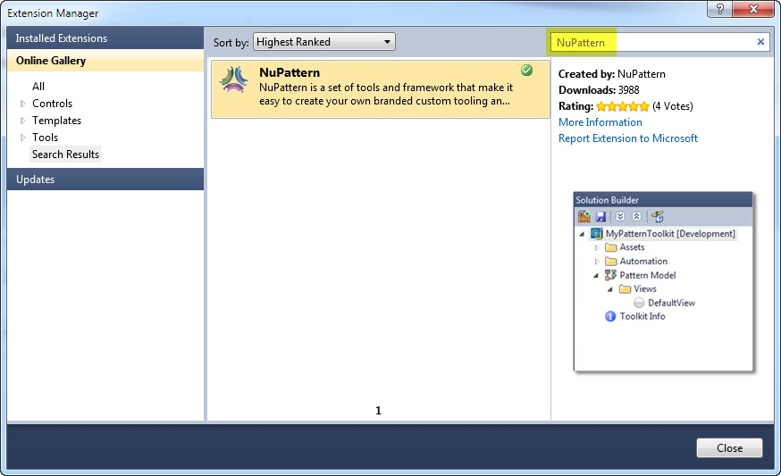

>{(_NuPattern nee VSPAT pre-2013_)}>
### Download and Install!
_Download the [latest release from here](http://nupattern.codeplex.com/releases)  today!_

# What is NuPattern?
NuPattern is the platform and tools that make it easy to create your own custom tooling in Visual Studio. 

* [Where to get it?](#wheretoget)
* [Getting started with it](Getting-Started)
* [More information](Documentation)

By now you are probably used to seeing different development extensions and templates in Visual Studio, some you like, and some offer little value to your project, except perhaps when it is in its very initial phases. 
There is a obviously a reason these general-purpose templates and tools have limited value to everyone in any project. That is because most software projects are unique, and many evolve patterns and rules defined by the architecture, software domain and development team.
 
Have you ever considered building your own custom development or deployment tools integrated in Visual Studio? or considered using custom tools built by others that you may follow in your communities? Tools that create/configure software the way you know you want it created, for specific use during your projects? Such as tools that your organization or community would want to use to build their applications using their agreed coding standards, project structures and architectural practices? Where can you get such specific tools?
No vendor can possibly build those kinds of tools for you or your organization, and certainly not rapidly or economically enough to help on your current project - right now.

NuPattern is a set of 'tools that build your tools' that enable you to create your own templates and automation that make creating the software in projects much quicker, more reliably and far cheaper.
Ever tried to create custom tools and templates in Visual Studio? It is impossibly hard, few can afford it, and even fewer in the world can do that. No longer the case with NuPattern. 

Simply define a logical model of how you want to understand the structure and patterns of your software, identify and how the pattern varies each time you apply it, and define parameters for that. Then decorate the model with templates, automation and instructive guidance, and NuPattern will automatically build you a new Visual Studio extension (toolkit) that you can share with others. Post the toolkit on a gallery and share with others in your communities the custom tools and templates you always wanted, tailored to their projects.

Spend six minutes watching the following video to understand what NuPattern is and how it can benefit you (go full screen for best viewing):

{video:url=https://www.youtube.com/watch?v=pHaBP2vQLt0,type=youtube,width=425,height=266}

# A New Approach
Building 'Pattern Toolkits' is a new approach to adding productivity and consistency to your software development and deployment projects. [Read more...](New-Approach)

# Where to get it?{anchor:wheretoget}
**From this site** you can download and install the latest version of the tools from the '[Downloads](http://vspat.codeplex.com/releases)' tab on this site.

**From within Visual Studio** you can search for, download, and install the tools from the [Visual Studio Gallery](http://visualstudiogallery.msdn.microsoft.com/332f060b-2352-41c9-b8dc-95d8ad21329b), in the 'Online Gallery' tab of the 'Extension Manager' in Visual Studio. 

# Getting Started
Once you have [downloaded](http://vspat.codeplex.com/releases) NuPattern, you will want to get started by heading over to the [Getting Started](Getting-Started) page.

# More Information
For more information, please see the [Documentation](Documentation) page.

Software IP management and project development governance provide by [Outercurve Foundation](www.outercurve.org)

>{The [NuPattern project landing page](http://www.outercurve.org/Galleries/DataLanguagesandSystemsInteroperability/NuPattern) at The Outercurve Foundation.}>