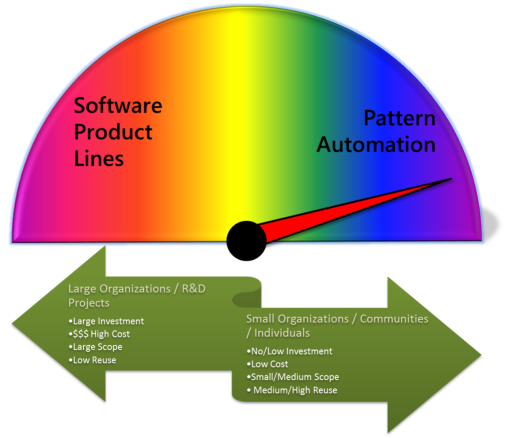

# Project History
This is the story of PLATU->VSPAT->NuPattern, how, why, when and where the project was chartered, conceived, proven, and developed into the project it is today.

## Introduction
The NuPattern project started in late 2009 within Microsoft in partnership with Raytheon to implement tooling and frameworks for applying the software factories methodology in an enterprise. 
The projects’ charter was to develop a set of tools in Visual Studio that enabled engineering organisations like Raytheon to define and deliver their own custom software factories, and have those software factories integrate with tooling in Visual Studio to increase productivity in custom solution development. 

What ensued from that was a discovery that uncovered the scope & requirements of a set of extensible tooling, and delivered that tooling regularly to a remarkable development group that used the tooling to build their own model driven ‘software factories’ for their customers. 

Today, the project flourishes in the open source community “forging a new direction that empowers software professionals to easily create their own custom tooling that builds software their way.”

## Back in the Day
In 2005, the Visual Studio and patterns & practices teams at Microsoft were working intensely on several developer tools: e.g. the Domain Specific Language (DSL) Tools, and the Guidance Automation Toolkit (GAX) that were identified on the Microsoft roadmap of ‘Software Factories’. 

Several software factories were built and released on that platform e.g. the Web Service Software Factory, Smart Client Software Factory, Web Client Software Factory, Mobile Client Software Factory. 

Although these software factories were very popular with enterprise developers and solution providers, in many cases they needed to be customized to align with their organizations development and coding standards, and some organizations and consultants desired to extend them to meet their own specific needs. Customization of the software factories on the DSL and GAX platform in Visual Studio 2005 and 2008, despite the excellent guidance provided, was an extremely difficult proposition, and proved to be out of reach of most development teams that could have benefited from customizing them. 

The Visual Studio Architect team (as it was known then) began making investments in building an uber ‘Software Factories’ tooling platform to address the growing market need to build custom software factories. This led to several improvements in the Visual Studio platform. But during the development of Visual Studio 2010, the Visual Studio Architect team decided to abandon their ‘software factories’ initiative and take a about-turn to pursue a UML tooling strategy instead. 

_“It was a simple case of market economics - going after an estimated 50% of market share of an established market in UML tools, versus going after 100% share of the unproven ‘software factories’ market where the true value and monetization strategy was yet to be realized”_

## Crunch Time
At the time, the [Software Factories Initiative](http://blogs.msdn.com/softwarefactories) which had gained some momentum and support (as well as healthy skepticism) in the development community, had yet to deliver a tooling framework or concrete approach that would support Microsoft’s customers in creating, executing, managing and customizing their own software factories. 

With no set of integrated tooling for running or building software factories (where GAX and DSL Tools were poorly integrated and difficult to extend) and with Visual Studio’s change in direction towards UML modeling, the ‘software factories initiative’ and vision eventually languished. 

There were a small number of ‘skunk-works’ attempts at addressing the market gap by building new tooling frameworks that took steps to move the vision forward. ‘Microsoft Blueprints’ proposed one direction, but never received any support from the Visual Studio team for it to flourish in the marketplace.

## New Opportunity
Meanwhile, in Boston a key customer of Microsoft’s, acclaimed  for several 20st century technology advancements, offered to partner with Microsoft to address their looming crisis in software development, and to help fulfill their own vision of the ‘Software Factories’ methodology in the enterprise. The proposal was to build a new, game-changing  agile software development facility (a new center of excellence) that would be focused on integrating systematic reuse and automation in modern software engineering practices, and prove out their vision of ‘Software Factories’ with Microsoft’s help. 

_Missing: Explanation of why Raytheon originally turned to Microsoft and Software Factories, with attribution_

## Advanced Software Productivity Environments
In late 2007, Microsoft and Raytheon joined forces to create the ‘Advanced Software Productivity ENvironments’ (ASPEN) program, which still runs to this day at Raytheon. 

The original charter of the program was to demonstrate to Raytheon’s engineering leadership that Raytheon could improve software development productivity dramatically by investing in improvements in lean software development processes and practices, and with advances in software development automation and tooling (a.k.a. ‘Software Factories’). 

A joint worldwide Microsoft and Raytheon team was assembled, and work began in earnest constructing a new agile development facility onsite at Raytheon. The facility was based on similar agile development facilities at Microsoft patterns & practices, and from research performed by leading agile workspace studies. 

The new facility knocked down traditional cubicle walls and walled offices, and replaced them with open workspaces, mobile furniture, all-round whiteboards, glass-walled conference rooms, a Microsoft Surface, XBOX and community lounge area and kitchen. Facilities that previously were not provided to software engineering programs at Raytheon. The ASPEN team grew to about 20 members over the course of the first 2 years, staffed with Raytheon engineers assisted by Microsoft consultants.

_Missing: testimony from a Raytheon engineer on how different it was being part of this unique team, with attribution_

In the first few months, the ASPEN team began to learn new development processes such as scrum, lean software development principles, and new Microsoft development languages and tools, all of which were unfamiliar to many of the experienced engineers. Sprints, continuous integration (CI), traffic lights, C#, .NET, MDSD tools, code generation, and Visual Studio started to become familiar with the team as they became focused on Model Driven Software Development (MDSD), domain specific languages (DSL), automation techniques - and ultimately building custom domain specific development tooling (DST). 

Soon, the team started delivering automation in hand-crafted domain specific ‘toolkits’ (in both Visual Studio and in Eclipse) to other engineering programs that would use them to automate the specific design, development and maintenance of their various systems and software projects. 

In mid-2009, after demonstrating dramatic productivity gains and cost efficiency in software development and deployment at Raytheon, the ASPEN program was ready to take the process to the next level of maturation and formalize the new processes and tooling they had developed for delivering standardized domain specific tool kits; as originally _envisioned_ by Microsoft’s ‘Software Factories’ initiative.

At this point in time, Microsoft was on the brink of releasing a new version of Visual Studio 2010 demonstrating their new line of UML modeling tools. The DSL Tools were also strongly supported, ironically, as the underlying platform which the UML tools were built on. Visual Studio 2010 also demonstrated some key advances in its extensibility architecture with the Managed Extensibility Framework (MEF), Visual Studio Extensions (VSIX) and the Visual Studio Gallery community. But the Guidance Automation Toolkit (GAT/GAX) was being sunset, and with it, the original software factories from patterns & practices.

## New Thinking
What Raytheon now needed to be more successful was a new domain specific tooling (DST) framework that incorporated the benefits of MDSD found in the DSL tools, with dramatic improvements to the automation and guidance frameworks of GAT/GAX, the patterns & practices software factories, and ‘Microsoft Blueprints’. 

Since there were no existing implementations of such a rich tooling framework in the market, it was quite intentionally back to the drawing board to tease out and envision the objectives, core scenarios and requirements that the ASPEN team and Microsoft had been exploring with the ASPEN center for the last 18 months.

What emerged was a desire for two major development capabilities: 
# A new foundational framework and design tools that provided the ability to create and browse rich, contextual, stateful, process-based guidance, that could be associated and integrated into the process of developing any kind of software component or solution.
# A new foundational model-driven automation framework and design tools that would provide the standardized platform to host domain specific toolkits that managed domain specific tooling, context, state, persistence, automation and IDE integration for developing of any templated software component or solution.
Both foundational frameworks would need to provide all the design-time tools and run-time support to create and execute self-contained, deployable, versionable, 'Product Line Toolkits’. These toolkits would then be installed, and would lay down plans complete with instructional guidance, and apply automation for assisting a developer through the configuration and generation of any software ‘product line’.

The Microsoft Visual Studio team at the time (almost code-complete on Visual Studio 2010) had few resources to apply to this new work, and signed up to deliver a post-release Visual Studio 2010 ‘Power Tool’ that delivered the foundational framework for contextual guidance. The [Feature Builder Power Tool](http://visualstudiogallery.msdn.microsoft.com/67b720f4-9a50-41cb-86a2-82e33b7c5fc4/) was released in late 2010, based in part upon previous work done in the ‘Microsoft Blueprints’ project. 

For the second foundation framework for model-driven automation tools, Microsoft put together an internal delivery team of leading Microsoft field consultants and Visual Studio extensibility experts from [Clarius Consulting](http://clariusconsulting.net/) to design and deliver that capability alongside the ASPEN team, as their first customer.

A new internal Microsoft project was funded and spun-up arbitrarily named ‘Project PLATU’. _The ‘Product Line, Authoring, Tailoring and Using’ project._ 

PLATU was chartered with distilling all that Microsoft had learned about previous generations of domain specific modeling, software factories and automation frameworks, and put the software factory ‘user’, ‘author’ and ‘tailor’ (a new role) foremost at the center of the framework and model-driven automation tools and approach. The project was to deliver not only the platform upon which ‘factories’ would run, but highly useable tools for building and customizing these factories.

At this point in time, much of the foundation of the ‘software factories’ vision and approach was believed to presume a ‘product line’ mentality and mindset, and so the awkward sounding acronym ‘PLATU’ stuck. 
The project began in earnest with the belief that a better toolset name would emerge once the true value of the processes and activities behind using such a foundational framework were actually realized in tools and marketplace. With the ASPEN team prioritizing the backlog for project PLATU, the project delivered a new Visual Studio tooling platform in lock-step with the ASPEN program. As the new PLATU tooling platform developed, the ASPEN team adopted those deliverables into their sprints to design and deliver their domain specific tooling to their customers. They fed back improvements and requirements into the next PLATU sprint. As the sprints for both teams progressed, and the PLATU tooling evolved, the ASPEN team was gradually and systematically relived of the complex, manual, and repetitive work they had been accustomed to performing in building their own hand crafted domain specific tooling from scratch.

_One of the things I remember thinking when we were first trying to develop toolkits without PLATU was "How will I ever be able to learn all of the ins and outs of developing Visual Studio extensibility/automation code to be able to supply seamless/cohesive toolkits?"  PLATU changed all that by supplying the extensibility and automation features for us – Melissa Palermo, Senior Software Engineer, Raytheon_

Within 9 months, project PLATU had delivered a fully featured set of authoring tools and runtime automation framework that enabled the ASPEN team to build custom domain specific toolkits very rapidly. With this new capability, ASPEN could now attract new work from within their organization and build and deliver domain specific tooling for many of its’ customers. 

Domain Specific Toolkits, then called ‘Automation Toolkits’ were being delivered within one or two, two-week sprints to ASPEN customers, and those customers were starting to realize surprising productivity and consistency gains using their rapidly-built and tailored new ‘Automation Toolkits’.

## Key Learning’s
As these ‘Automation Toolkits’ began to emerge, and as the ASPEN team repeatedly went through the steps of envisioning, designing, building and delivering the automation toolkits for their customers, with their customers. It quickly became clear that the demand for building these kinds of domain specific ’toolkits’ and software automation was not in fact required by, limited to, or shaped by existing software product lines (SPL’s). Rather, there was more of a requirement to automate repetitive, manual development tasks that reduces manual error, and improved the consistency and quality of software. 

More often than not, this software was based upon existing proven software implementation patterns, rather than pre-determined software product lines. What was needed was the ability to capture and harvest these implementation patterns and rapidly automate them with generative technics and automation.
> It was quickly realized (by an organization with significant experience employing software product line architectures, and that is very experienced with Model Driven Software Development (MDSD) tools and approaches) that SPLs were in-practice very hard, expensive, time consuming and risky to design, realize and adopt where there were far more opportunities to automate simpler and smaller  design patterns. 

With ‘Automation Toolkits’ being so easy and economical to design, build and customize in the new PLATU tools, project PLATU dropped the requirement for SPL as the basis and pre-requisite for building toolkits altogether. Instead, recognizing that what added immediate value to any software development team or community, was ad-hoc ‘proven implementation patterns’, not formal ‘software product lines architectures’.

_PLATU dramatically shifted focus from SPLs to focus on capturing the broader market of organizations/communities/individual experts who just wanted tooling that would automate their own proven design patterns realized from software they have already built, which is already known and proven to work for them and their communities._

The focus of the PLATU tooling quickly moved away from supporting big-upfront-design (BUFD) processes and the ‘model-only’ exclusivity that generally goes hand in hand with existing MDSD practices and toolsets. And instead aligned itself with more ‘agile’ practices and processes that tailored themselves to accommodating rapid change.

With this shift in focus, the moniker ‘Software Factory’ to describe what PLATU was building, or the approach of how they were built, was eventually abandoned. Instead, it was demonstrated by ASPEN, that in fact what was occurring was closer to something like ‘Pattern Automation’ and that this was felt to be more of an appropriate term to describe the underlying activity for which these toolkits were being demanded by other software engineering programs. 

_Missing: Ironic piece on how ASPEN was creating Eclipse tooling with VSPAT, with attribution_

## Pattern Automation
In late 2010, after incubating and infusing the new PLATU project in the ASPEN program, and shifting the focus to applying the technology to other customers, Microsoft rebranded the PLATU toolset as the ‘Visual Studio Pattern Automation Toolkit (VSPAT)’. As a move to capture the Visual Studio 2010 audience, and to seek adoption of these new tools and practices internally at Microsoft. 

VSPAT was driven as the platform for the development of packaged software IP offerings that delivered much needed consistency and predictability in custom solutions and offerings from its worldwide field consulting businesses (Microsoft Consulting Services). 

With several successes from a small number of field and product groups within Microsoft, the VSPAT toolset was slowly gaining momentum within Microsoft engineering groups wishing to automate their development and deployment processes. 

Several 'Pattern Toolkits' were built, which included toolkits for building Azure Auto-Scaling development solutions, Lync deployment solutions, and Active Directory solutions. Surprisingly, many toolkits targeted the deployment of software products and solutions, not just the development of software. Toolkits that created Windows Server data center platforms and deployed Windows Server products.

The development tools for the Microsoft Amalga health product were also released, establishing VSPAT as the new tooling platform. 

However, this new automation capability and its benefits remained largely hidden within the walls of Microsoft, and not on the Visual Studio product road map. But the intended market for VSPAT had always been those who would benefit the most from its flexibility, and that was Microsoft’s larger development customer base of solution development and deployment partners and customers. 

In early 2012, VSPAT was finally released by Microsoft on the [Visual Studio Gallery](http://visualstudiogallery.msdn.microsoft.com/332f060b-2352-41c9-b8dc-95d8ad21329b), and then shortly afterwards open sourced on [CodePlex](http://nupattern.codeplex.com). Shortly after that, the ownership of the project was transferred to the [The Outercurve Foundation](http://www.outercurve.org/News/articleType/ArticleView/articleId/56/Outercurve-Foundation-Announces-Acceptance-of-Visual-Studio-Pattern-Automation-Toolkit) to prevent the value of the technology from languishing out of sight in Microsoft. 

Today, the [NuPattern Project](http://nupattern.org) is evolving as an open sourced community project, supported by members of the original ASPEN, Clarius and Microsoft teams, and gaining new momentum.

The project has a great deal of people to thank for inception, incubation, innovation, delivery and support of the project. Please see our [Acknowledgements](Project-Thanks) page.
